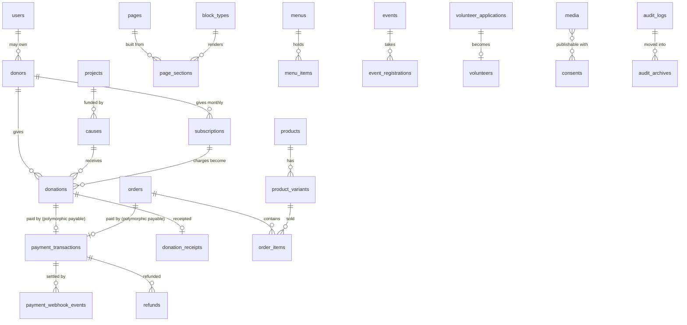

# Database reference

Generated from the live schema on 2026-09-18 (`scghf_dev`, 135 tables, migrations through `2026_09_18_000001`). Regenerate with the script in `docs/DATABASE.md` §5 after any migration. The conventions — integer pesewas, ULIDs, append-only money tables, soft deletes, the migration-safety policy — are in `PHASE-3-DATA-ARCHITECTURE.md` and are not repeated here.

## 1. The spine



## 2. Tables by module

Types are MySQL's. **PK** primary key, **U** unique, **I** indexed, **FK →** foreign key. `*_minor` columns are integer pesewas; `ulid` columns are the public identifier and `id` never leaves the server.

### Core & auth

#### `users`

| Column | Type | Null | Key | Default |
|---|---|---|---|---|
| `id` | bigint unsigned |  | PK | auto |
| `ulid` | char(26) |  | U |  |
| `name` | varchar(191) |  |  |  |
| `email` | varchar(191) |  | U |  |
| `email_verified_at` | timestamp | yes |  |  |
| `pending_email` | varchar(191) | yes | U |  |
| `password` | varchar(255) |  |  |  |
| `remember_token` | varchar(100) | yes |  |  |
| `phone` | varchar(20) | yes | I |  |
| `phone_raw` | varchar(32) | yes |  |  |
| `phone_verified_at` | timestamp | yes |  |  |
| `type` | varchar(32) |  | I | `donor` |
| `job_title` | varchar(191) | yes |  |  |
| `bio` | text | yes |  |  |
| `locale` | varchar(10) |  |  | `en` |
| `timezone` | varchar(64) |  |  | `Africa/Accra` |
| `two_factor_secret` | text | yes |  |  |
| `two_factor_recovery_codes` | text | yes |  |  |
| `two_factor_confirmed_at` | timestamp | yes |  |  |
| `is_active` | tinyint(1) |  | I | `1` |
| `suspended_at` | timestamp | yes |  |  |
| `suspended_reason` | varchar(191) | yes |  |  |
| `last_login_at` | timestamp | yes |  |  |
| `last_login_ip` | varchar(45) | yes |  |  |
| `accepts_email_marketing` | tinyint(1) |  |  | `0` |
| `accepts_sms_marketing` | tinyint(1) |  |  | `0` |
| `marketing_consent_at` | timestamp | yes |  |  |
| `created_at` | timestamp | yes |  |  |
| `updated_at` | timestamp | yes |  |  |
| `deleted_at` | timestamp | yes |  |  |
| `pending_email_requested_at` | timestamp | yes |  |  |

#### `roles`

| Column | Type | Null | Key | Default |
|---|---|---|---|---|
| `id` | bigint unsigned |  | PK | auto |
| `name` | varchar(255) |  | I |  |
| `guard_name` | varchar(255) |  |  |  |
| `created_at` | timestamp | yes |  |  |
| `updated_at` | timestamp | yes |  |  |

#### `permissions`

| Column | Type | Null | Key | Default |
|---|---|---|---|---|
| `id` | bigint unsigned |  | PK | auto |
| `name` | varchar(255) |  | I |  |
| `guard_name` | varchar(255) |  |  |  |
| `created_at` | timestamp | yes |  |  |
| `updated_at` | timestamp | yes |  |  |

#### `model_has_roles`

| Column | Type | Null | Key | Default |
|---|---|---|---|---|
| `role_id` | bigint unsigned |  | PK FK → `roles.id` |  |
| `model_type` | varchar(255) |  | PK |  |
| `model_id` | bigint unsigned |  | PK |  |

#### `model_has_permissions`

| Column | Type | Null | Key | Default |
|---|---|---|---|---|
| `permission_id` | bigint unsigned |  | PK FK → `permissions.id` |  |
| `model_type` | varchar(255) |  | PK |  |
| `model_id` | bigint unsigned |  | PK |  |

#### `role_has_permissions`

| Column | Type | Null | Key | Default |
|---|---|---|---|---|
| `permission_id` | bigint unsigned |  | PK FK → `permissions.id` |  |
| `role_id` | bigint unsigned |  | PK FK → `roles.id` |  |

#### `login_histories`

| Column | Type | Null | Key | Default |
|---|---|---|---|---|
| `id` | bigint unsigned |  | PK | auto |
| `user_id` | bigint unsigned | yes | I FK → `users.id` |  |
| `email_attempted` | varchar(191) |  | I |  |
| `outcome` | varchar(32) |  | I |  |
| `ip_address` | varchar(45) | yes | I |  |
| `user_agent` | text | yes |  |  |
| `device_type` | varchar(32) | yes |  |  |
| `platform` | varchar(64) | yes |  |  |
| `browser` | varchar(64) | yes |  |  |
| `country_code` | varchar(2) | yes |  |  |
| `was_two_factor_used` | tinyint(1) |  |  | `0` |
| `is_new_device` | tinyint(1) |  |  | `0` |
| `created_at` | timestamp | yes | I |  |

#### `api_tokens`

| Column | Type | Null | Key | Default |
|---|---|---|---|---|
| `id` | bigint unsigned |  | PK | auto |
| `ulid` | char(26) |  | U |  |
| `name` | varchar(100) |  |  |  |
| `token_hash` | char(64) |  | U |  |
| `prefix` | varchar(12) |  | I |  |
| `user_id` | bigint unsigned |  | I FK → `users.id` |  |
| `abilities` | json | yes |  |  |
| `allowed_ips` | json | yes |  |  |
| `expires_at` | timestamp |  | I |  |
| `last_used_at` | timestamp | yes |  |  |
| `last_used_ip` | varchar(45) | yes |  |  |
| `use_count` | int unsigned |  |  | `0` |
| `revoked_at` | timestamp | yes |  |  |
| `revoked_by` | bigint unsigned | yes | I FK → `users.id` |  |
| `revoke_reason` | varchar(191) | yes |  |  |
| `rate_limit_per_minute` | smallint unsigned |  |  | `60` |
| `created_by` | bigint unsigned | yes | I FK → `users.id` |  |
| `created_at` | timestamp | yes |  |  |
| `updated_at` | timestamp | yes |  |  |

#### `password_reset_tokens`

| Column | Type | Null | Key | Default |
|---|---|---|---|---|
| `email` | varchar(191) |  | PK |  |
| `token` | varchar(255) |  |  |  |
| `created_at` | timestamp | yes |  |  |

#### `sessions`

| Column | Type | Null | Key | Default |
|---|---|---|---|---|
| `id` | varchar(255) |  | PK |  |
| `user_id` | bigint unsigned | yes | I |  |
| `ip_address` | varchar(45) | yes |  |  |
| `user_agent` | text | yes |  |  |
| `payload` | longtext |  |  |  |
| `last_activity` | int |  | I |  |

#### `settings_history`

| Column | Type | Null | Key | Default |
|---|---|---|---|---|
| `id` | bigint unsigned |  | PK | auto |
| `setting_key` | varchar(128) |  | I |  |
| `old_value` | text | yes |  |  |
| `new_value` | text | yes |  |  |
| `is_redacted` | tinyint(1) |  |  | `0` |
| `changed_by` | bigint unsigned | yes | I FK → `users.id` |  |
| `changed_by_label` | varchar(191) | yes |  |  |
| `ip_address` | varchar(45) | yes |  |  |
| `changed_at` | timestamp |  | I |  |
| `created_at` | timestamp | yes |  |  |

### Settings & CMS

#### `settings`

| Column | Type | Null | Key | Default |
|---|---|---|---|---|
| `id` | bigint unsigned |  | PK | auto |
| `group` | varchar(64) |  | I |  |
| `key` | varchar(128) |  |  |  |
| `value` | text | yes |  |  |
| `type` | varchar(32) |  |  | `string` |
| `label` | varchar(191) |  |  |  |
| `description` | text | yes |  |  |
| `is_public` | tinyint(1) |  |  | `0` |
| `is_encrypted` | tinyint(1) |  |  | `0` |
| `is_locked` | tinyint(1) |  |  | `0` |
| `validation` | varchar(255) | yes |  |  |
| `options` | json | yes |  |  |
| `sort_order` | smallint unsigned |  |  | `0` |
| `updated_by` | bigint unsigned | yes | I FK → `users.id` |  |
| `created_at` | timestamp | yes |  |  |
| `updated_at` | timestamp | yes |  |  |

#### `theme_settings`

| Column | Type | Null | Key | Default |
|---|---|---|---|---|
| `id` | bigint unsigned |  | PK | auto |
| `theme` | varchar(16) |  | I |  |
| `token` | varchar(64) |  |  |  |
| `category` | varchar(32) |  |  |  |
| `value` | varchar(191) |  |  |  |
| `label` | varchar(191) |  |  |  |
| `description` | text | yes |  |  |
| `contrast_against` | varchar(64) | yes |  |  |
| `min_contrast` | decimal(4,2) | yes |  |  |
| `is_locked` | tinyint(1) |  |  | `0` |
| `sort_order` | smallint unsigned |  |  | `0` |
| `updated_by` | bigint unsigned | yes | I FK → `users.id` |  |
| `created_at` | timestamp | yes |  |  |
| `updated_at` | timestamp | yes |  |  |

#### `pages`

| Column | Type | Null | Key | Default |
|---|---|---|---|---|
| `id` | bigint unsigned |  | PK | auto |
| `ulid` | char(26) |  | U |  |
| `parent_id` | bigint unsigned | yes | I FK → `pages.id` |  |
| `title` | varchar(191) |  |  |  |
| `slug` | varchar(191) |  |  |  |
| `path` | varchar(191) |  | U |  |
| `excerpt` | text | yes |  |  |
| `template` | varchar(64) |  |  | `default` |
| `status` | varchar(32) |  | I | `draft` |
| `published_at` | timestamp | yes |  |  |
| `is_homepage` | tinyint(1) |  | I | `0` |
| `is_locked` | tinyint(1) |  |  | `0` |
| `show_in_sitemap` | tinyint(1) |  |  | `1` |
| `show_in_search` | tinyint(1) |  |  | `1` |
| `sort_order` | smallint unsigned |  |  | `0` |
| `created_by` | bigint unsigned | yes | I FK → `users.id` |  |
| `updated_by` | bigint unsigned | yes | I FK → `users.id` |  |
| `deleted_by` | bigint unsigned | yes | I FK → `users.id` |  |
| `created_at` | timestamp | yes |  |  |
| `updated_at` | timestamp | yes |  |  |
| `deleted_at` | timestamp | yes |  |  |

#### `page_sections`

| Column | Type | Null | Key | Default |
|---|---|---|---|---|
| `id` | bigint unsigned |  | PK | auto |
| `ulid` | char(26) |  | U |  |
| `page_id` | bigint unsigned |  | I FK → `pages.id` |  |
| `block_type` | varchar(64) |  | I |  |
| `name` | varchar(191) | yes |  |  |
| `data` | json | yes |  |  |
| `settings` | json | yes |  |  |
| `sort_order` | smallint unsigned |  |  | `0` |
| `is_visible` | tinyint(1) |  |  | `1` |
| `visible_from` | timestamp | yes |  |  |
| `visible_until` | timestamp | yes |  |  |
| `created_at` | timestamp | yes |  |  |
| `updated_at` | timestamp | yes |  |  |

#### `page_revisions`

| Column | Type | Null | Key | Default |
|---|---|---|---|---|
| `id` | bigint unsigned |  | PK | auto |
| `page_id` | bigint unsigned |  | I FK → `pages.id` |  |
| `user_id` | bigint unsigned | yes | I FK → `users.id` |  |
| `revision_number` | int unsigned |  |  |  |
| `snapshot` | longtext |  |  |  |
| `summary` | varchar(191) | yes |  |  |
| `created_at` | timestamp | yes |  |  |

#### `block_types`

| Column | Type | Null | Key | Default |
|---|---|---|---|---|
| `id` | bigint unsigned |  | PK | auto |
| `key` | varchar(64) |  | U |  |
| `is_enabled` | tinyint(1) |  | I | `1` |
| `sort_order` | smallint unsigned |  |  | `0` |
| `max_per_page` | smallint unsigned | yes |  |  |
| `created_at` | timestamp | yes |  |  |
| `updated_at` | timestamp | yes |  |  |

#### `menus`

| Column | Type | Null | Key | Default |
|---|---|---|---|---|
| `id` | bigint unsigned |  | PK | auto |
| `key` | varchar(64) |  | U |  |
| `name` | varchar(191) |  |  |  |
| `description` | text | yes |  |  |
| `is_locked` | tinyint(1) |  |  | `0` |
| `max_depth` | tinyint unsigned |  |  | `1` |
| `updated_by` | bigint unsigned | yes | I FK → `users.id` |  |
| `created_at` | timestamp | yes |  |  |
| `updated_at` | timestamp | yes |  |  |

#### `menu_items`

| Column | Type | Null | Key | Default |
|---|---|---|---|---|
| `id` | bigint unsigned |  | PK | auto |
| `ulid` | char(26) |  | U |  |
| `menu_id` | bigint unsigned |  | I FK → `menus.id` |  |
| `parent_id` | bigint unsigned | yes | I FK → `menu_items.id` |  |
| `label` | varchar(191) |  |  |  |
| `link_type` | varchar(32) |  |  | `page` |
| `page_id` | bigint unsigned | yes | I FK → `pages.id` |  |
| `route_name` | varchar(128) | yes |  |  |
| `url` | varchar(500) | yes |  |  |
| `linkable_type` | varchar(255) | yes | I |  |
| `linkable_id` | bigint unsigned | yes |  |  |
| `icon` | varchar(64) | yes |  |  |
| `is_highlighted` | tinyint(1) |  |  | `0` |
| `opens_in_new_tab` | tinyint(1) |  |  | `0` |
| `visible_to` | varchar(16) |  |  | `all` |
| `sort_order` | smallint unsigned |  |  | `0` |
| `is_visible` | tinyint(1) |  |  | `1` |
| `created_at` | timestamp | yes |  |  |
| `updated_at` | timestamp | yes |  |  |

#### `media`

| Column | Type | Null | Key | Default |
|---|---|---|---|---|
| `id` | bigint unsigned |  | PK | auto |
| `folder_id` | bigint unsigned | yes | I FK → `media_folders.id` |  |
| `model_type` | varchar(255) |  | I |  |
| `model_id` | bigint unsigned |  |  |  |
| `uuid` | char(36) | yes | U |  |
| `collection_name` | varchar(255) |  |  |  |
| `name` | varchar(255) |  |  |  |
| `alt_text` | varchar(500) | yes |  |  |
| `depicts_people` | tinyint(1) |  | I | `0` |
| `depicts_children` | tinyint(1) |  |  | `0` |
| `withdrawn_at` | timestamp | yes |  |  |
| `withdrawn_reason` | varchar(500) | yes |  |  |
| `withdrawn_by` | bigint unsigned | yes | I FK → `users.id` |  |
| `caption` | varchar(500) | yes |  |  |
| `metadata_stripped_at` | timestamp | yes | I |  |
| `had_gps_data` | tinyint(1) |  | I | `0` |
| `stripped_metadata_keys` | json | yes |  |  |
| `sanitisation_error` | varchar(500) | yes |  |  |
| `credit` | varchar(191) | yes |  |  |
| `file_name` | varchar(255) |  |  |  |
| `mime_type` | varchar(255) | yes |  |  |
| `disk` | varchar(255) |  |  |  |
| `conversions_disk` | varchar(255) | yes |  |  |
| `size` | bigint unsigned |  |  |  |
| `manipulations` | json |  |  |  |
| `custom_properties` | json |  |  |  |
| `generated_conversions` | json |  |  |  |
| `responsive_images` | json |  |  |  |
| `order_column` | int unsigned | yes | I |  |
| `created_at` | timestamp | yes |  |  |
| `updated_at` | timestamp | yes |  |  |

#### `media_folders`

| Column | Type | Null | Key | Default |
|---|---|---|---|---|
| `id` | bigint unsigned |  | PK | auto |
| `ulid` | char(26) |  | U |  |
| `parent_id` | bigint unsigned | yes | I FK → `media_folders.id` |  |
| `name` | varchar(191) |  |  |  |
| `slug` | varchar(191) |  |  |  |
| `path` | varchar(500) |  | U |  |
| `description` | text | yes |  |  |
| `is_locked` | tinyint(1) |  |  | `0` |
| `sort_order` | smallint unsigned |  |  | `0` |
| `created_by` | bigint unsigned | yes | I FK → `users.id` |  |
| `created_at` | timestamp | yes |  |  |
| `updated_at` | timestamp | yes |  |  |

#### `consents`

| Column | Type | Null | Key | Default |
|---|---|---|---|---|
| `id` | bigint unsigned |  | PK | auto |
| `ulid` | char(26) |  | U |  |
| `consentable_type` | varchar(255) |  | I |  |
| `consentable_id` | bigint unsigned |  |  |  |
| `consent_type` | varchar(32) |  | I |  |
| `scope` | varchar(32) |  |  | `website` |
| `granted_by_name` | varchar(191) |  |  |  |
| `granted_by_relationship` | varchar(32) |  |  | `self` |
| `is_minor` | tinyint(1) |  |  | `0` |
| `guardian_name` | varchar(191) | yes |  |  |
| `granted_at` | timestamp |  |  |  |
| `expires_at` | timestamp | yes |  |  |
| `revoked_at` | timestamp | yes |  |  |
| `revoked_reason` | varchar(255) | yes |  |  |
| `evidence_media_id` | bigint unsigned | yes | I FK → `media.id` |  |
| `notes` | text | yes |  |  |
| `captured_ip` | varchar(45) | yes |  |  |
| `recorded_by` | bigint unsigned | yes | I FK → `users.id` |  |
| `created_at` | timestamp | yes |  |  |
| `updated_at` | timestamp | yes |  |  |

#### `seo_meta`

| Column | Type | Null | Key | Default |
|---|---|---|---|---|
| `id` | bigint unsigned |  | PK | auto |
| `seoable_type` | varchar(255) |  | I |  |
| `seoable_id` | bigint unsigned |  |  |  |
| `title` | varchar(191) | yes |  |  |
| `description` | varchar(500) | yes |  |  |
| `keywords` | varchar(500) | yes |  |  |
| `canonical_url` | varchar(500) | yes |  |  |
| `og_title` | varchar(191) | yes |  |  |
| `og_description` | varchar(500) | yes |  |  |
| `og_image_id` | bigint unsigned | yes | I FK → `media.id` |  |
| `og_type` | varchar(32) |  |  | `website` |
| `twitter_card` | varchar(32) |  |  | `summary_large_image` |
| `no_index` | tinyint(1) |  |  | `0` |
| `no_follow` | tinyint(1) |  |  | `0` |
| `change_frequency` | varchar(16) | yes |  |  |
| `priority` | decimal(2,1) | yes |  |  |
| `updated_by` | bigint unsigned | yes | I FK → `users.id` |  |
| `created_at` | timestamp | yes |  |  |
| `updated_at` | timestamp | yes |  |  |

#### `redirects`

| Column | Type | Null | Key | Default |
|---|---|---|---|---|
| `id` | bigint unsigned |  | PK | auto |
| `from_path` | varchar(191) |  | U |  |
| `to_path` | varchar(500) | yes |  |  |
| `status_code` | smallint unsigned |  |  | `301` |
| `source` | varchar(32) |  |  | `manual` |
| `is_active` | tinyint(1) |  | I | `1` |
| `preserve_query` | tinyint(1) |  |  | `0` |
| `hits` | int unsigned |  | I | `0` |
| `last_hit_at` | timestamp | yes |  |  |
| `last_referrer` | varchar(500) | yes |  |  |
| `notes` | text | yes |  |  |
| `created_by` | bigint unsigned | yes | I FK → `users.id` |  |
| `created_at` | timestamp | yes |  |  |
| `updated_at` | timestamp | yes |  |  |

#### `announcements`

| Column | Type | Null | Key | Default |
|---|---|---|---|---|
| `id` | bigint unsigned |  | PK | auto |
| `ulid` | char(26) |  | U |  |
| `placement` | varchar(32) |  | I | `announcement_bar` |
| `title` | varchar(191) |  |  |  |
| `body` | text | yes |  |  |
| `cta_label` | varchar(64) | yes |  |  |
| `cta_url` | varchar(500) | yes |  |  |
| `image_id` | bigint unsigned | yes | I FK → `media.id` |  |
| `style` | varchar(32) |  |  | `info` |
| `is_dismissible` | tinyint(1) |  |  | `1` |
| `dismiss_days` | smallint unsigned |  |  | `30` |
| `show_on_paths` | json | yes |  |  |
| `starts_at` | timestamp | yes |  |  |
| `ends_at` | timestamp | yes |  |  |
| `impressions` | int unsigned |  |  | `0` |
| `clicks` | int unsigned |  |  | `0` |
| `sort_order` | smallint unsigned |  |  | `0` |
| `is_active` | tinyint(1) |  |  | `0` |
| `created_by` | bigint unsigned | yes | I FK → `users.id` |  |
| `created_at` | timestamp | yes |  |  |
| `updated_at` | timestamp | yes |  |  |
| `division_id` | bigint unsigned | yes | I FK → `divisions.id` |  |

#### `divisions`

| Column | Type | Null | Key | Default |
|---|---|---|---|---|
| `id` | bigint unsigned |  | PK | auto |
| `ulid` | char(26) |  | U |  |
| `name` | varchar(191) |  |  |  |
| `slug` | varchar(191) |  | U |  |
| `tagline` | varchar(191) | yes |  |  |
| `summary` | text | yes |  |  |
| `description` | longtext | yes |  |  |
| `colour_token` | varchar(64) | yes |  |  |
| `icon` | varchar(64) | yes |  |  |
| `logo_id` | bigint unsigned | yes | I FK → `media.id` |  |
| `hero_image_id` | bigint unsigned | yes | I FK → `media.id` |  |
| `sort_order` | smallint unsigned |  |  | `0` |
| `is_active` | tinyint(1) |  | I | `1` |
| `is_locked` | tinyint(1) |  |  | `0` |
| `created_by` | bigint unsigned | yes | I FK → `users.id` |  |
| `updated_by` | bigint unsigned | yes | I FK → `users.id` |  |
| `created_at` | timestamp | yes |  |  |
| `updated_at` | timestamp | yes |  |  |
| `deleted_at` | timestamp | yes |  |  |

#### `offices`

| Column | Type | Null | Key | Default |
|---|---|---|---|---|
| `id` | bigint unsigned |  | PK | auto |
| `name` | varchar(191) |  |  |  |
| `address` | varchar(500) | yes |  |  |
| `gps_address` | varchar(32) | yes |  |  |
| `city` | varchar(191) | yes |  |  |
| `region` | varchar(191) | yes |  |  |
| `phone` | varchar(32) | yes |  |  |
| `whatsapp` | varchar(32) | yes |  |  |
| `email` | varchar(191) | yes |  |  |
| `hours` | json | yes |  |  |
| `directions_url` | varchar(500) | yes |  |  |
| `notes` | text | yes |  |  |
| `is_primary` | tinyint(1) |  |  | `0` |
| `is_active` | tinyint(1) |  | I | `1` |
| `sort_order` | smallint unsigned |  |  | `0` |
| `created_at` | timestamp | yes |  |  |
| `updated_at` | timestamp | yes |  |  |

### Content

#### `posts`

| Column | Type | Null | Key | Default |
|---|---|---|---|---|
| `id` | bigint unsigned |  | PK | auto |
| `ulid` | char(26) |  | U |  |
| `blog_category_id` | bigint unsigned | yes | I FK → `blog_categories.id` |  |
| `author_id` | bigint unsigned | yes | I FK → `users.id` |  |
| `title` | varchar(191) |  |  |  |
| `slug` | varchar(191) |  | U |  |
| `excerpt` | text | yes |  |  |
| `body` | longtext | yes |  |  |
| `featured_image_id` | bigint unsigned | yes | I FK → `media.id` |  |
| `status` | varchar(32) |  | I | `draft` |
| `published_at` | timestamp | yes |  |  |
| `is_featured` | tinyint(1) |  | I | `0` |
| `allow_comments` | tinyint(1) |  |  | `1` |
| `comment_count` | int unsigned |  |  | `0` |
| `view_count` | int unsigned |  |  | `0` |
| `reading_minutes` | smallint unsigned | yes |  |  |
| `created_by` | bigint unsigned | yes | I FK → `users.id` |  |
| `updated_by` | bigint unsigned | yes | I FK → `users.id` |  |
| `created_at` | timestamp | yes |  |  |
| `updated_at` | timestamp | yes |  |  |
| `deleted_at` | timestamp | yes |  |  |
| `division_id` | bigint unsigned | yes | I FK → `divisions.id` |  |

#### `blog_categories`

| Column | Type | Null | Key | Default |
|---|---|---|---|---|
| `id` | bigint unsigned |  | PK | auto |
| `name` | varchar(191) |  |  |  |
| `slug` | varchar(191) |  | U |  |
| `description` | text | yes |  |  |
| `colour` | varchar(16) | yes |  |  |
| `sort_order` | smallint unsigned |  |  | `0` |
| `is_published` | tinyint(1) |  |  | `1` |
| `created_at` | timestamp | yes |  |  |
| `updated_at` | timestamp | yes |  |  |
| `deleted_at` | timestamp | yes |  |  |

#### `tags`

| Column | Type | Null | Key | Default |
|---|---|---|---|---|
| `id` | bigint unsigned |  | PK | auto |
| `name` | varchar(96) |  |  |  |
| `slug` | varchar(96) |  | U |  |
| `usage_count` | int unsigned |  |  | `0` |
| `created_at` | timestamp | yes |  |  |
| `updated_at` | timestamp | yes |  |  |

#### `taggables`

| Column | Type | Null | Key | Default |
|---|---|---|---|---|
| `tag_id` | bigint unsigned |  | PK FK → `tags.id` |  |
| `taggable_type` | varchar(255) |  | PK |  |
| `taggable_id` | bigint unsigned |  | PK |  |

#### `comments`

| Column | Type | Null | Key | Default |
|---|---|---|---|---|
| `id` | bigint unsigned |  | PK | auto |
| `ulid` | char(26) |  | U |  |
| `post_id` | bigint unsigned |  | I FK → `posts.id` |  |
| `parent_id` | bigint unsigned | yes | I FK → `comments.id` |  |
| `user_id` | bigint unsigned | yes | I FK → `users.id` |  |
| `author_name` | varchar(191) |  |  |  |
| `author_email` | varchar(191) |  | I |  |
| `body` | text |  |  |  |
| `status` | varchar(32) |  | I | `pending` |
| `ip_address` | varchar(45) | yes |  |  |
| `user_agent` | text | yes |  |  |
| `moderated_by` | bigint unsigned | yes | I FK → `users.id` |  |
| `moderated_at` | timestamp | yes |  |  |
| `created_at` | timestamp | yes |  |  |
| `updated_at` | timestamp | yes |  |  |
| `deleted_at` | timestamp | yes |  |  |

#### `galleries`

| Column | Type | Null | Key | Default |
|---|---|---|---|---|
| `id` | bigint unsigned |  | PK | auto |
| `ulid` | char(26) |  | U |  |
| `title` | varchar(191) |  |  |  |
| `slug` | varchar(191) |  | U |  |
| `description` | text | yes |  |  |
| `cover_id` | bigint unsigned | yes | I FK → `media.id` |  |
| `taken_on` | date | yes |  |  |
| `location` | varchar(191) | yes |  |  |
| `has_consent` | tinyint(1) |  |  | `0` |
| `sort_order` | smallint unsigned |  |  | `0` |
| `is_published` | tinyint(1) |  | I | `0` |
| `created_by` | bigint unsigned | yes | I FK → `users.id` |  |
| `created_at` | timestamp | yes |  |  |
| `updated_at` | timestamp | yes |  |  |
| `deleted_at` | timestamp | yes |  |  |
| `division_id` | bigint unsigned | yes | I FK → `divisions.id` |  |

#### `gallery_items`

| Column | Type | Null | Key | Default |
|---|---|---|---|---|
| `id` | bigint unsigned |  | PK | auto |
| `gallery_id` | bigint unsigned |  | I FK → `galleries.id` |  |
| `media_id` | bigint unsigned |  | I FK → `media.id` |  |
| `caption` | varchar(500) | yes |  |  |
| `sort_order` | smallint unsigned |  |  | `0` |
| `created_at` | timestamp | yes |  |  |
| `updated_at` | timestamp | yes |  |  |

#### `documents`

| Column | Type | Null | Key | Default |
|---|---|---|---|---|
| `id` | bigint unsigned |  | PK | auto |
| `ulid` | char(26) |  | U |  |
| `title` | varchar(191) |  |  |  |
| `slug` | varchar(191) |  | U |  |
| `description` | text | yes |  |  |
| `media_id` | bigint unsigned | yes | I FK → `media.id` |  |
| `document_type` | varchar(32) |  | I | `other` |
| `year` | smallint unsigned | yes |  |  |
| `requires_auth` | tinyint(1) |  |  | `0` |
| `download_count` | int unsigned |  |  | `0` |
| `sort_order` | smallint unsigned |  |  | `0` |
| `is_published` | tinyint(1) |  | I | `0` |
| `created_by` | bigint unsigned | yes | I FK → `users.id` |  |
| `created_at` | timestamp | yes |  |  |
| `updated_at` | timestamp | yes |  |  |
| `deleted_at` | timestamp | yes |  |  |
| `division_id` | bigint unsigned | yes | I FK → `divisions.id` |  |

#### `faqs`

| Column | Type | Null | Key | Default |
|---|---|---|---|---|
| `id` | bigint unsigned |  | PK | auto |
| `faq_category_id` | bigint unsigned | yes | I FK → `faq_categories.id` |  |
| `question` | varchar(500) |  |  |  |
| `answer` | text |  |  |  |
| `view_count` | int unsigned |  |  | `0` |
| `sort_order` | smallint unsigned |  |  | `0` |
| `is_published` | tinyint(1) |  | I | `1` |
| `is_featured` | tinyint(1) |  |  | `0` |
| `created_by` | bigint unsigned | yes | I FK → `users.id` |  |
| `updated_by` | bigint unsigned | yes | I FK → `users.id` |  |
| `created_at` | timestamp | yes |  |  |
| `updated_at` | timestamp | yes |  |  |
| `deleted_at` | timestamp | yes |  |  |
| `division_id` | bigint unsigned | yes | I FK → `divisions.id` |  |

#### `faq_categories`

| Column | Type | Null | Key | Default |
|---|---|---|---|---|
| `id` | bigint unsigned |  | PK | auto |
| `name` | varchar(191) |  |  |  |
| `slug` | varchar(191) |  | U |  |
| `description` | text | yes |  |  |
| `icon` | varchar(64) | yes |  |  |
| `sort_order` | smallint unsigned |  |  | `0` |
| `is_published` | tinyint(1) |  |  | `1` |
| `created_at` | timestamp | yes |  |  |
| `updated_at` | timestamp | yes |  |  |
| `deleted_at` | timestamp | yes |  |  |

#### `testimonials`

| Column | Type | Null | Key | Default |
|---|---|---|---|---|
| `id` | bigint unsigned |  | PK | auto |
| `ulid` | char(26) |  | U |  |
| `author_name` | varchar(191) |  |  |  |
| `author_role` | varchar(191) | yes |  |  |
| `author_location` | varchar(191) | yes |  |  |
| `quote` | text |  |  |  |
| `author_type` | varchar(32) |  |  | `beneficiary` |
| `photo_id` | bigint unsigned | yes | I FK → `media.id` |  |
| `has_consent` | tinyint(1) |  |  | `0` |
| `consent_date` | date | yes |  |  |
| `sort_order` | smallint unsigned |  |  | `0` |
| `is_published` | tinyint(1) |  | I | `0` |
| `is_featured` | tinyint(1) |  |  | `0` |
| `created_by` | bigint unsigned | yes | I FK → `users.id` |  |
| `created_at` | timestamp | yes |  |  |
| `updated_at` | timestamp | yes |  |  |
| `deleted_at` | timestamp | yes |  |  |
| `division_id` | bigint unsigned | yes | I FK → `divisions.id` |  |

#### `partners`

| Column | Type | Null | Key | Default |
|---|---|---|---|---|
| `id` | bigint unsigned |  | PK | auto |
| `name` | varchar(191) |  |  |  |
| `slug` | varchar(191) |  | U |  |
| `description` | text | yes |  |  |
| `website_url` | varchar(500) | yes |  |  |
| `logo_id` | bigint unsigned | yes | I FK → `media.id` |  |
| `partner_type` | varchar(32) |  |  | `organisation` |
| `partnership_started_on` | date | yes |  |  |
| `partnership_ended_on` | date | yes |  |  |
| `sort_order` | smallint unsigned |  |  | `0` |
| `is_published` | tinyint(1) |  | I | `1` |
| `is_featured` | tinyint(1) |  |  | `0` |
| `created_at` | timestamp | yes |  |  |
| `updated_at` | timestamp | yes |  |  |
| `deleted_at` | timestamp | yes |  |  |
| `division_id` | bigint unsigned | yes | I FK → `divisions.id` |  |

#### `partner_project`

| Column | Type | Null | Key | Default |
|---|---|---|---|---|
| `id` | bigint unsigned |  | PK | auto |
| `project_id` | bigint unsigned |  | I FK → `projects.id` |  |
| `partner_id` | bigint unsigned |  | I FK → `partners.id` |  |
| `role` | varchar(32) |  |  | `implementer` |

#### `team_members`

| Column | Type | Null | Key | Default |
|---|---|---|---|---|
| `id` | bigint unsigned |  | PK | auto |
| `ulid` | char(26) |  | U |  |
| `team_department_id` | bigint unsigned | yes | I FK → `team_departments.id` |  |
| `user_id` | bigint unsigned | yes | I FK → `users.id` |  |
| `name` | varchar(191) |  |  |  |
| `slug` | varchar(191) |  | U |  |
| `role_title` | varchar(191) |  |  |  |
| `bio` | text | yes |  |  |
| `photo_id` | bigint unsigned | yes | I FK → `media.id` |  |
| `public_email` | varchar(191) | yes |  |  |
| `linkedin_url` | varchar(500) | yes |  |  |
| `member_type` | varchar(32) |  |  | `staff` |
| `is_trustee` | tinyint(1) |  |  | `0` |
| `joined_on` | date | yes |  |  |
| `left_on` | date | yes |  |  |
| `sort_order` | smallint unsigned |  |  | `0` |
| `is_published` | tinyint(1) |  | I | `0` |
| `created_at` | timestamp | yes |  |  |
| `updated_at` | timestamp | yes |  |  |
| `deleted_at` | timestamp | yes |  |  |
| `division_id` | bigint unsigned | yes | I FK → `divisions.id` |  |

#### `team_departments`

| Column | Type | Null | Key | Default |
|---|---|---|---|---|
| `id` | bigint unsigned |  | PK | auto |
| `name` | varchar(191) |  |  |  |
| `slug` | varchar(191) |  | U |  |
| `description` | text | yes |  |  |
| `sort_order` | smallint unsigned |  |  | `0` |
| `is_published` | tinyint(1) |  |  | `1` |
| `created_at` | timestamp | yes |  |  |
| `updated_at` | timestamp | yes |  |  |

#### `stories`

| Column | Type | Null | Key | Default |
|---|---|---|---|---|
| `id` | bigint unsigned |  | PK | auto |
| `ulid` | char(26) |  | U |  |
| `beneficiary_id` | bigint unsigned | yes | I FK → `beneficiaries.id` |  |
| `division_id` | bigint unsigned | yes | I FK → `divisions.id` |  |
| `project_id` | bigint unsigned | yes | I FK → `projects.id` |  |
| `title` | varchar(191) |  |  |  |
| `slug` | varchar(191) |  | U |  |
| `summary` | text | yes |  |  |
| `body` | longtext |  |  |  |
| `subject_display_name` | varchar(191) | yes |  |  |
| `uses_pseudonym` | tinyint(1) |  |  | `0` |
| `image_id` | bigint unsigned | yes | I FK → `media.id` |  |
| `is_featured` | tinyint(1) |  |  | `0` |
| `is_published` | tinyint(1) |  | I | `0` |
| `published_at` | timestamp | yes |  |  |
| `created_by` | bigint unsigned | yes | I FK → `users.id` |  |
| `created_at` | timestamp | yes |  |  |
| `updated_at` | timestamp | yes |  |  |
| `deleted_at` | timestamp | yes |  |  |

#### `document_project`

| Column | Type | Null | Key | Default |
|---|---|---|---|---|
| `id` | bigint unsigned |  | PK | auto |
| `project_id` | bigint unsigned |  | I FK → `projects.id` |  |
| `document_id` | bigint unsigned |  | I FK → `documents.id` |  |
| `sort_order` | smallint unsigned |  |  | `0` |

### Programmes & impact

#### `focus_areas`

| Column | Type | Null | Key | Default |
|---|---|---|---|---|
| `id` | bigint unsigned |  | PK | auto |
| `ulid` | char(26) |  | U |  |
| `division_id` | bigint unsigned |  | I FK → `divisions.id` |  |
| `name` | varchar(191) |  |  |  |
| `slug` | varchar(191) |  | U |  |
| `description` | text | yes |  |  |
| `icon` | varchar(64) | yes |  |  |
| `sort_order` | smallint unsigned |  |  | `0` |
| `is_active` | tinyint(1) |  |  | `1` |
| `created_at` | timestamp | yes |  |  |
| `updated_at` | timestamp | yes |  |  |
| `deleted_at` | timestamp | yes |  |  |

#### `focus_area_project`

| Column | Type | Null | Key | Default |
|---|---|---|---|---|
| `id` | bigint unsigned |  | PK | auto |
| `project_id` | bigint unsigned |  | I FK → `projects.id` |  |
| `focus_area_id` | bigint unsigned |  | I FK → `focus_areas.id` |  |

#### `projects`

| Column | Type | Null | Key | Default |
|---|---|---|---|---|
| `id` | bigint unsigned |  | PK | auto |
| `ulid` | char(26) |  | U |  |
| `division_id` | bigint unsigned | yes | I FK → `divisions.id` |  |
| `title` | varchar(191) |  |  |  |
| `slug` | varchar(191) |  | U |  |
| `summary` | text | yes |  |  |
| `description` | longtext | yes |  |  |
| `status` | varchar(32) |  | I | `planned` |
| `starts_on` | date | yes |  |  |
| `ends_on` | date | yes |  |  |
| `completed_on` | date | yes |  |  |
| `budget_minor` | bigint unsigned | yes |  |  |
| `currency` | char(3) |  |  | `GHS` |
| `beneficiary_count` | int unsigned |  |  | `0` |
| `featured_image_id` | bigint unsigned | yes | I FK → `media.id` |  |
| `lead_id` | bigint unsigned | yes | I FK → `users.id` |  |
| `is_featured` | tinyint(1) |  |  | `0` |
| `is_published` | tinyint(1) |  | I | `0` |
| `published_at` | timestamp | yes |  |  |
| `created_by` | bigint unsigned | yes | I FK → `users.id` |  |
| `updated_by` | bigint unsigned | yes | I FK → `users.id` |  |
| `created_at` | timestamp | yes |  |  |
| `updated_at` | timestamp | yes |  |  |
| `deleted_at` | timestamp | yes |  |  |

#### `project_updates`

| Column | Type | Null | Key | Default |
|---|---|---|---|---|
| `id` | bigint unsigned |  | PK | auto |
| `ulid` | char(26) |  | U |  |
| `project_id` | bigint unsigned |  | I FK → `projects.id` |  |
| `title` | varchar(191) |  |  |  |
| `slug` | varchar(191) |  |  |  |
| `body` | longtext |  |  |  |
| `image_id` | bigint unsigned | yes | I FK → `media.id` |  |
| `author_id` | bigint unsigned | yes | I FK → `users.id` |  |
| `is_published` | tinyint(1) |  |  | `0` |
| `published_at` | timestamp | yes |  |  |
| `created_at` | timestamp | yes |  |  |
| `updated_at` | timestamp | yes |  |  |
| `deleted_at` | timestamp | yes |  |  |

#### `project_milestones`

| Column | Type | Null | Key | Default |
|---|---|---|---|---|
| `id` | bigint unsigned |  | PK | auto |
| `project_id` | bigint unsigned |  | I FK → `projects.id` |  |
| `title` | varchar(191) |  |  |  |
| `description` | text | yes |  |  |
| `status` | varchar(32) |  | I | `pending` |
| `due_on` | date | yes |  |  |
| `achieved_on` | date | yes |  |  |
| `sort_order` | smallint unsigned |  |  | `0` |
| `is_public` | tinyint(1) |  |  | `1` |
| `created_at` | timestamp | yes |  |  |
| `updated_at` | timestamp | yes |  |  |

#### `project_locations`

| Column | Type | Null | Key | Default |
|---|---|---|---|---|
| `id` | bigint unsigned |  | PK | auto |
| `project_id` | bigint unsigned |  | I FK → `projects.id` |  |
| `name` | varchar(191) |  |  |  |
| `region` | varchar(191) | yes | I |  |
| `district` | varchar(191) | yes |  |  |
| `community` | varchar(191) | yes |  |  |
| `latitude` | decimal(10,7) | yes |  |  |
| `longitude` | decimal(10,7) | yes |  |  |
| `is_primary` | tinyint(1) |  |  | `0` |
| `sort_order` | smallint unsigned |  |  | `0` |
| `created_at` | timestamp | yes |  |  |
| `updated_at` | timestamp | yes |  |  |

#### `impact_metrics`

| Column | Type | Null | Key | Default |
|---|---|---|---|---|
| `id` | bigint unsigned |  | PK | auto |
| `ulid` | char(26) |  | U |  |
| `division_id` | bigint unsigned | yes | I FK → `divisions.id` |  |
| `project_id` | bigint unsigned | yes | I FK → `projects.id` |  |
| `name` | varchar(191) |  |  |  |
| `slug` | varchar(191) |  | U |  |
| `description` | text | yes |  |  |
| `unit` | varchar(64) | yes |  |  |
| `value_type` | varchar(32) |  |  | `integer` |
| `aggregation` | varchar(32) |  |  | `sum` |
| `counts_people` | tinyint(1) |  |  | `0` |
| `baseline_value` | decimal(20,4) | yes |  |  |
| `target_value` | decimal(20,4) | yes |  |  |
| `icon` | varchar(64) | yes |  |  |
| `sort_order` | smallint unsigned |  |  | `0` |
| `is_public` | tinyint(1) |  | I | `1` |
| `is_featured` | tinyint(1) |  |  | `0` |
| `created_at` | timestamp | yes |  |  |
| `updated_at` | timestamp | yes |  |  |
| `deleted_at` | timestamp | yes |  |  |

#### `impact_metric_values`

| Column | Type | Null | Key | Default |
|---|---|---|---|---|
| `id` | bigint unsigned |  | PK | auto |
| `impact_metric_id` | bigint unsigned |  | I FK → `impact_metrics.id` |  |
| `period_start` | date |  |  |  |
| `period_end` | date | yes |  |  |
| `value` | decimal(20,4) |  |  |  |
| `notes` | text | yes |  |  |
| `source` | varchar(191) | yes |  |  |
| `recorded_by` | bigint unsigned | yes | I FK → `users.id` |  |
| `verified_at` | timestamp | yes |  |  |
| `verified_by` | bigint unsigned | yes | I FK → `users.id` |  |
| `created_at` | timestamp | yes |  |  |
| `updated_at` | timestamp | yes |  |  |

#### `beneficiaries`

| Column | Type | Null | Key | Default |
|---|---|---|---|---|
| `id` | bigint unsigned |  | PK | auto |
| `ulid` | char(26) |  | U |  |
| `case_reference` | varchar(32) |  | U |  |
| `division_id` | bigint unsigned | yes | I FK → `divisions.id` |  |
| `project_id` | bigint unsigned | yes | I FK → `projects.id` |  |
| `focus_area_id` | bigint unsigned | yes | I FK → `focus_areas.id` |  |
| `status` | varchar(32) |  | I | `draft` |
| `full_name` | varchar(191) |  |  |  |
| `other_names` | varchar(191) | yes |  |  |
| `phone` | text | yes |  |  |
| `email` | text | yes |  |  |
| `ghana_card_number` | text | yes |  |  |
| `ghana_card_index` | char(64) | yes | I |  |
| `date_of_birth` | date | yes |  |  |
| `address` | text | yes |  |  |
| `community` | varchar(191) | yes |  |  |
| `latitude` | decimal(10,7) | yes |  |  |
| `longitude` | decimal(10,7) | yes |  |  |
| `bank_account` | text | yes |  |  |
| `momo_number` | text | yes |  |  |
| `next_of_kin_name` | text | yes |  |  |
| `next_of_kin_phone` | text | yes |  |  |
| `household_details` | text | yes |  |  |
| `school_or_employer` | text | yes |  |  |
| `religion` | text | yes |  |  |
| `medical_notes` | text | yes |  |  |
| `application_narrative` | longtext | yes |  |  |
| `case_notes` | longtext | yes |  |  |
| `photo_id` | bigint unsigned | yes | I FK → `media.id` |  |
| `signature_id` | bigint unsigned | yes | I FK → `media.id` |  |
| `id_document_id` | bigint unsigned | yes | I FK → `media.id` |  |
| `intake_ip` | varchar(45) | yes |  |  |
| `gender` | varchar(16) | yes |  |  |
| `region` | varchar(191) | yes |  |  |
| `district` | varchar(191) | yes |  |  |
| `assistance_minor` | bigint unsigned | yes |  |  |
| `currency` | char(3) |  |  | `GHS` |
| `assisted_on` | date | yes |  |  |
| `outcome` | varchar(32) | yes |  |  |
| `submitted_at` | timestamp | yes |  |  |
| `decided_at` | timestamp | yes | I |  |
| `last_activity_at` | timestamp | yes | I |  |
| `closed_at` | timestamp | yes |  |  |
| `case_worker_id` | bigint unsigned | yes | I FK → `users.id` |  |
| `created_by` | bigint unsigned | yes | I FK → `users.id` |  |
| `created_at` | timestamp | yes |  |  |
| `updated_at` | timestamp | yes |  |  |
| `deleted_at` | timestamp | yes |  |  |

#### `beneficiary_documents`

| Column | Type | Null | Key | Default |
|---|---|---|---|---|
| `id` | bigint unsigned |  | PK | auto |
| `ulid` | char(26) |  | U |  |
| `beneficiary_id` | bigint unsigned |  | I FK → `beneficiaries.id` |  |
| `media_id` | bigint unsigned | yes | I FK → `media.id` |  |
| `title` | varchar(191) |  |  |  |
| `document_type` | varchar(32) |  |  | `other` |
| `description` | text | yes |  |  |
| `is_sensitive` | tinyint(1) |  | I | `0` |
| `closed_at` | timestamp | yes |  |  |
| `uploaded_by` | bigint unsigned | yes | I FK → `users.id` |  |
| `created_at` | timestamp | yes |  |  |
| `updated_at` | timestamp | yes |  |  |

#### `beneficiary_notes`

| Column | Type | Null | Key | Default |
|---|---|---|---|---|
| `id` | bigint unsigned |  | PK | auto |
| `beneficiary_id` | bigint unsigned |  | I FK → `beneficiaries.id` |  |
| `author_id` | bigint unsigned | yes | I FK → `users.id` |  |
| `kind` | varchar(16) |  |  | `note` |
| `body` | text |  |  |  |
| `created_at` | timestamp | yes |  |  |

#### `beneficiary_impact_records`

| Column | Type | Null | Key | Default |
|---|---|---|---|---|
| `id` | bigint unsigned |  | PK | auto |
| `source_beneficiary_id` | bigint unsigned | yes | I FK → `beneficiaries.id` |  |
| `division_id` | bigint unsigned | yes | I FK → `divisions.id` |  |
| `project_id` | bigint unsigned | yes | I FK → `projects.id` |  |
| `focus_area_id` | bigint unsigned | yes | I FK → `focus_areas.id` |  |
| `region` | varchar(191) | yes | I |  |
| `district` | varchar(191) | yes |  |  |
| `gender` | varchar(16) | yes |  |  |
| `age_band` | varchar(16) | yes |  |  |
| `assistance_band` | varchar(64) | yes |  |  |
| `assistance_period` | varchar(16) | yes |  |  |
| `outcome` | varchar(32) | yes | I |  |
| `created_at` | timestamp | yes |  |  |
| `updated_at` | timestamp | yes |  |  |

#### `legal_holds`

| Column | Type | Null | Key | Default |
|---|---|---|---|---|
| `id` | bigint unsigned |  | PK | auto |
| `ulid` | char(26) |  | U |  |
| `reference` | varchar(64) |  | U |  |
| `title` | varchar(191) |  |  |  |
| `reason` | text |  |  |  |
| `hold_type` | varchar(32) |  |  | `legal` |
| `holdable_type` | varchar(255) | yes | I |  |
| `holdable_id` | bigint unsigned | yes |  |  |
| `retention_class` | varchar(64) | yes |  |  |
| `scope_key` | varchar(191) | yes |  |  |
| `placed_on` | date |  |  |  |
| `placed_by` | bigint unsigned | yes | I FK → `users.id` |  |
| `review_on` | date | yes |  |  |
| `released_on` | date | yes |  |  |
| `released_by` | bigint unsigned | yes | I FK → `users.id` |  |
| `release_reason` | text | yes |  |  |
| `is_active` | tinyint(1) |  | I | `1` |
| `created_at` | timestamp | yes |  |  |
| `updated_at` | timestamp | yes |  |  |

#### `retention_log`

| Column | Type | Null | Key | Default |
|---|---|---|---|---|
| `id` | bigint unsigned |  | PK | auto |
| `retention_class` | varchar(64) |  | I |  |
| `subject_type` | varchar(191) |  | I |  |
| `subject_id` | bigint unsigned |  |  |  |
| `subject_digest` | varchar(64) | yes |  |  |
| `action` | varchar(32) |  |  |  |
| `detail` | text | yes |  |  |
| `legal_hold_id` | bigint unsigned | yes | I FK → `legal_holds.id` |  |
| `run_id` | varchar(36) | yes | I |  |
| `performed_by` | bigint unsigned | yes | I FK → `users.id` |  |
| `created_at` | timestamp | yes |  |  |

#### `privacy_test_subjects`

| Column | Type | Null | Key | Default |
|---|---|---|---|---|
| `id` | bigint unsigned |  | PK | auto |
| `full_name` | varchar(255) |  |  |  |
| `phone` | varchar(255) | yes |  |  |
| `ghana_card` | varchar(255) | yes |  |  |
| `date_of_birth` | date | yes |  |  |
| `community` | varchar(255) | yes |  |  |
| `case_notes` | text | yes |  |  |
| `assistance_minor` | bigint unsigned | yes |  |  |
| `district` | varchar(255) | yes |  |  |
| `closed_at` | timestamp | yes |  |  |
| `created_at` | timestamp | yes |  |  |
| `updated_at` | timestamp | yes |  |  |

### Fundraising & payments

#### `causes`

| Column | Type | Null | Key | Default |
|---|---|---|---|---|
| `id` | bigint unsigned |  | PK | auto |
| `ulid` | char(26) |  | U |  |
| `division_id` | bigint unsigned | yes | I FK → `divisions.id` |  |
| `project_id` | bigint unsigned | yes | I FK → `projects.id` |  |
| `title` | varchar(191) |  |  |  |
| `slug` | varchar(191) |  | U |  |
| `summary` | text | yes |  |  |
| `description` | longtext | yes |  |  |
| `goal_minor` | bigint unsigned | yes |  |  |
| `giving_levels` | json | yes |  |  |
| `min_donation_minor` | bigint unsigned | yes |  |  |
| `raised_minor` | bigint unsigned |  |  | `0` |
| `donation_count` | int unsigned |  |  | `0` |
| `currency` | char(3) |  |  | `GHS` |
| `starts_on` | date | yes |  |  |
| `ends_on` | date | yes |  |  |
| `status` | varchar(32) |  | I | `draft` |
| `goal_reached_behaviour` | varchar(16) |  |  | `continue` |
| `redirect_cause_id` | bigint unsigned | yes | I FK → `causes.id` |  |
| `fund_code` | varchar(32) | yes |  |  |
| `is_general_fund` | tinyint(1) |  | I | `0` |
| `is_locked` | tinyint(1) |  |  | `0` |
| `is_tax_deductible` | tinyint(1) |  |  | `0` |
| `tax_approval_id` | bigint unsigned | yes | I FK → `tax_approvals.id` |  |
| `allow_recurring` | tinyint(1) |  |  | `1` |
| `allow_fee_cover` | tinyint(1) |  |  | `1` |
| `featured_image_id` | bigint unsigned | yes | I FK → `media.id` |  |
| `is_featured` | tinyint(1) |  |  | `0` |
| `is_urgent` | tinyint(1) |  | I | `0` |
| `is_published` | tinyint(1) |  | I | `0` |
| `published_at` | timestamp | yes |  |  |
| `sort_order` | smallint unsigned |  |  | `0` |
| `created_by` | bigint unsigned | yes | I FK → `users.id` |  |
| `updated_by` | bigint unsigned | yes | I FK → `users.id` |  |
| `created_at` | timestamp | yes |  |  |
| `updated_at` | timestamp | yes |  |  |
| `deleted_at` | timestamp | yes |  |  |

#### `cause_updates`

| Column | Type | Null | Key | Default |
|---|---|---|---|---|
| `id` | bigint unsigned |  | PK | auto |
| `ulid` | char(26) |  | U |  |
| `cause_id` | bigint unsigned |  | I FK → `causes.id` |  |
| `title` | varchar(191) |  |  |  |
| `slug` | varchar(191) |  |  |  |
| `body` | longtext |  |  |  |
| `image_id` | bigint unsigned | yes | I FK → `media.id` |  |
| `author_id` | bigint unsigned | yes | I FK → `users.id` |  |
| `is_published` | tinyint(1) |  |  | `0` |
| `published_at` | timestamp | yes |  |  |
| `created_at` | timestamp | yes |  |  |
| `updated_at` | timestamp | yes |  |  |
| `deleted_at` | timestamp | yes |  |  |

#### `donations`

| Column | Type | Null | Key | Default |
|---|---|---|---|---|
| `id` | bigint unsigned |  | PK | auto |
| `ulid` | char(26) |  | U |  |
| `reference` | varchar(32) |  | U |  |
| `donor_id` | bigint unsigned | yes | I FK → `donors.id` |  |
| `user_id` | bigint unsigned | yes | I FK → `users.id` |  |
| `cause_id` | bigint unsigned |  | I FK → `causes.id` |  |
| `division_id` | bigint unsigned | yes | I FK → `divisions.id` |  |
| `amount_minor` | bigint unsigned |  |  |  |
| `fee_minor` | bigint unsigned |  |  | `0` |
| `fee_covered_by_donor` | tinyint(1) |  |  | `0` |
| `wants_recurring` | tinyint(1) |  |  | `0` |
| `recurring_interval` | varchar(16) | yes |  |  |
| `net_minor` | bigint unsigned |  |  |  |
| `deductible_amount_minor` | bigint unsigned |  |  | `0` |
| `currency` | char(3) |  |  | `GHS` |
| `status` | varchar(32) |  | I | `pending` |
| `channel` | varchar(32) | yes |  |  |
| `momo_network` | varchar(32) | yes |  |  |
| `momo_provider` | varchar(16) | yes |  |  |
| `offline_method` | varchar(32) | yes |  |  |
| `offline_reference` | varchar(191) | yes | I |  |
| `received_on` | date | yes |  |  |
| `is_anonymous` | tinyint(1) |  |  | `0` |
| `tribute_type` | varchar(32) | yes |  |  |
| `tribute_name` | varchar(191) | yes |  |  |
| `tribute_message` | text | yes |  |  |
| `tribute_notify_email` | varchar(191) | yes |  |  |
| `public_message` | text | yes |  |  |
| `donor_name` | varchar(191) | yes |  |  |
| `donor_email` | varchar(191) | yes | I |  |
| `donor_phone` | varchar(32) | yes |  |  |
| `consent_email` | tinyint(1) |  |  | `0` |
| `consent_sms` | tinyint(1) |  |  | `0` |
| `consent_text` | text | yes |  |  |
| `consent_ip` | varchar(45) | yes |  |  |
| `consent_at` | timestamp | yes |  |  |
| `paid_at` | timestamp | yes | I |  |
| `failed_at` | timestamp | yes |  |  |
| `paystack_reference` | varchar(191) | yes | I |  |
| `notes` | text | yes |  |  |
| `source` | varchar(64) | yes | I |  |
| `utm` | json | yes |  |  |
| `recorded_by` | bigint unsigned | yes | I FK → `users.id` |  |
| `created_at` | timestamp | yes |  |  |
| `updated_at` | timestamp | yes |  |  |
| `subscription_id` | bigint unsigned | yes | I FK → `subscriptions.id` |  |
| `order_id` | bigint unsigned | yes | I FK → `orders.id` |  |
| `order_item_id` | bigint unsigned | yes | U FK → `order_items.id` |  |
| `fundraiser_id` | bigint unsigned | yes | I FK → `fundraisers.id` |  |
| `pledge_id` | bigint unsigned | yes | I FK → `pledges.id` |  |

#### `donation_items`

| Column | Type | Null | Key | Default |
|---|---|---|---|---|
| `id` | bigint unsigned |  | PK | auto |
| `donation_id` | bigint unsigned |  | I FK → `donations.id` |  |
| `cause_id` | bigint unsigned |  | I FK → `causes.id` |  |
| `division_id` | bigint unsigned | yes | I FK → `divisions.id` |  |
| `project_id` | bigint unsigned | yes | I FK → `projects.id` |  |
| `amount_minor` | bigint unsigned |  |  |  |
| `currency` | char(3) |  |  | `GHS` |
| `is_tax_deductible` | tinyint(1) |  |  | `0` |
| `tax_approval_id` | bigint unsigned | yes | I FK → `tax_approvals.id` |  |
| `description` | varchar(191) | yes |  |  |
| `created_at` | timestamp | yes |  |  |
| `updated_at` | timestamp | yes |  |  |

#### `donation_receipts`

| Column | Type | Null | Key | Default |
|---|---|---|---|---|
| `id` | bigint unsigned |  | PK | auto |
| `ulid` | char(26) |  | U |  |
| `donation_id` | bigint unsigned |  | U FK → `donations.id` |  |
| `receipt_number` | varchar(32) |  | U |  |
| `financial_year` | smallint unsigned |  | I |  |
| `sequence` | int unsigned |  |  |  |
| `issued_on` | date |  |  |  |
| `donor_name` | varchar(191) |  |  |  |
| `donor_email` | varchar(191) | yes | I |  |
| `organisation_name` | varchar(191) |  |  |  |
| `organisation_tin` | varchar(64) |  |  |  |
| `amount_minor` | bigint unsigned |  |  |  |
| `deductible_amount_minor` | bigint unsigned |  |  | `0` |
| `non_deductible_amount_minor` | bigint unsigned |  |  | `0` |
| `currency` | char(3) |  |  | `GHS` |
| `amount_in_words` | varchar(500) |  |  |  |
| `cause` | varchar(191) |  |  |  |
| `payment_reference` | varchar(191) | yes |  |  |
| `donated_on` | date |  |  |  |
| `cites_approval` | tinyint(1) |  |  | `0` |
| `tax_approval_id` | bigint unsigned | yes | I FK → `tax_approvals.id` |  |
| `approval_reference` | varchar(191) | yes |  |  |
| `approval_validity` | varchar(191) | yes |  |  |
| `statement` | longtext |  |  |  |
| `authentication` | varchar(191) | yes |  |  |
| `pdf_media_id` | bigint unsigned | yes | I FK → `media.id` |  |
| `sent_at` | timestamp | yes |  |  |
| `sent_to` | varchar(191) | yes |  |  |
| `issued_by` | bigint unsigned | yes | I FK → `users.id` |  |
| `created_at` | timestamp | yes |  |  |
| `updated_at` | timestamp | yes |  |  |

#### `donors`

| Column | Type | Null | Key | Default |
|---|---|---|---|---|
| `id` | bigint unsigned |  | PK | auto |
| `ulid` | char(26) |  | U |  |
| `user_id` | bigint unsigned | yes | I FK → `users.id` |  |
| `name` | varchar(191) |  |  |  |
| `email` | varchar(191) | yes | I |  |
| `phone` | varchar(32) | yes | I |  |
| `phone_raw` | varchar(32) | yes |  |  |
| `donor_type` | varchar(32) |  |  | `individual` |
| `organisation_name` | varchar(191) | yes |  |  |
| `address` | varchar(255) | yes |  |  |
| `city` | varchar(191) | yes |  |  |
| `country` | varchar(2) | yes |  |  |
| `consent_email` | tinyint(1) |  |  | `0` |
| `consent_sms` | tinyint(1) |  |  | `0` |
| `consent_text` | text | yes |  |  |
| `consent_ip` | varchar(45) | yes |  |  |
| `consent_at` | timestamp | yes |  |  |
| `total_donated_minor` | bigint unsigned |  |  | `0` |
| `donation_count` | int unsigned |  |  | `0` |
| `first_donated_at` | timestamp | yes |  |  |
| `last_donated_at` | timestamp | yes | I |  |
| `is_anonymous_by_default` | tinyint(1) |  |  | `0` |
| `notes` | text | yes |  |  |
| `created_at` | timestamp | yes |  |  |
| `updated_at` | timestamp | yes |  |  |
| `deleted_at` | timestamp | yes |  |  |

#### `donation_plans`

| Column | Type | Null | Key | Default |
|---|---|---|---|---|
| `id` | bigint unsigned |  | PK | auto |
| `ulid` | char(26) |  | U |  |
| `cause_id` | bigint unsigned | yes | I FK → `causes.id` |  |
| `division_id` | bigint unsigned | yes | I FK → `divisions.id` |  |
| `name` | varchar(191) |  |  |  |
| `slug` | varchar(191) |  | U |  |
| `description` | text | yes |  |  |
| `amount_minor` | bigint unsigned | yes |  |  |
| `currency` | char(3) |  |  | `GHS` |
| `interval` | varchar(32) |  |  | `monthly` |
| `paystack_plan_code` | varchar(191) | yes |  |  |
| `sort_order` | smallint unsigned |  |  | `0` |
| `is_active` | tinyint(1) |  | I | `1` |
| `created_at` | timestamp | yes |  |  |
| `updated_at` | timestamp | yes |  |  |
| `deleted_at` | timestamp | yes |  |  |

#### `subscriptions`

| Column | Type | Null | Key | Default |
|---|---|---|---|---|
| `id` | bigint unsigned |  | PK | auto |
| `ulid` | char(26) |  | U |  |
| `reference` | varchar(32) |  | U |  |
| `donor_id` | bigint unsigned |  | I FK → `donors.id` |  |
| `donation_plan_id` | bigint unsigned | yes | I FK → `donation_plans.id` |  |
| `cause_id` | bigint unsigned |  | I FK → `causes.id` |  |
| `division_id` | bigint unsigned | yes | I FK → `divisions.id` |  |
| `amount_minor` | bigint unsigned |  |  |  |
| `currency` | char(3) |  |  | `GHS` |
| `interval` | varchar(32) |  |  | `monthly` |
| `driver` | varchar(32) |  |  | `managed` |
| `status` | varchar(32) |  | I | `active` |
| `started_on` | date |  |  |  |
| `next_charge_on` | date | yes |  |  |
| `ended_on` | date | yes |  |  |
| `cancel_reason` | varchar(191) | yes |  |  |
| `authorization_code` | varchar(191) | yes |  |  |
| `authorization_reusable` | tinyint(1) |  |  | `0` |
| `channel` | varchar(32) | yes |  |  |
| `card_last4` | varchar(4) | yes |  |  |
| `paystack_subscription_code` | varchar(191) | yes | I |  |
| `paystack_customer_code` | varchar(191) | yes |  |  |
| `paystack_email_token` | varchar(191) | yes |  |  |
| `charge_count` | int unsigned |  |  | `0` |
| `total_charged_minor` | bigint unsigned |  |  | `0` |
| `failed_attempts` | smallint unsigned |  |  | `0` |
| `created_at` | timestamp | yes |  |  |
| `updated_at` | timestamp | yes |  |  |

#### `subscription_charges`

| Column | Type | Null | Key | Default |
|---|---|---|---|---|
| `id` | bigint unsigned |  | PK | auto |
| `subscription_id` | bigint unsigned |  | I FK → `subscriptions.id` |  |
| `donation_id` | bigint unsigned | yes | I FK → `donations.id` |  |
| `scheduled_on` | date |  |  |  |
| `attempted_at` | timestamp | yes |  |  |
| `status` | varchar(32) |  | I | `scheduled` |
| `amount_minor` | bigint unsigned |  |  |  |
| `currency` | char(3) |  |  | `GHS` |
| `failure_reason` | text | yes |  |  |
| `attempt` | smallint unsigned |  |  | `1` |
| `created_at` | timestamp | yes |  |  |
| `updated_at` | timestamp | yes |  |  |

#### `pledges`

| Column | Type | Null | Key | Default |
|---|---|---|---|---|
| `id` | bigint unsigned |  | PK | auto |
| `ulid` | char(26) |  | U |  |
| `reference` | varchar(32) |  | U |  |
| `donor_id` | bigint unsigned | yes | I FK → `donors.id` |  |
| `user_id` | bigint unsigned | yes | I FK → `users.id` |  |
| `cause_id` | bigint unsigned |  | I FK → `causes.id` |  |
| `division_id` | bigint unsigned | yes | I FK → `divisions.id` |  |
| `pledger_name` | varchar(191) |  |  |  |
| `pledger_email` | varchar(191) | yes | I |  |
| `pledger_phone` | varchar(20) | yes |  |  |
| `amount_minor` | bigint unsigned |  |  |  |
| `fulfilled_minor` | bigint unsigned |  |  | `0` |
| `currency` | char(3) |  |  | `GHS` |
| `status` | varchar(32) |  | I | `pledged` |
| `due_on` | date | yes |  |  |
| `occasion` | varchar(32) | yes |  |  |
| `notes` | text | yes |  |  |
| `reminders_sent` | tinyint unsigned |  |  | `0` |
| `last_reminded_at` | timestamp | yes |  |  |
| `consent_to_remind` | tinyint(1) |  |  | `0` |
| `fulfilled_at` | timestamp | yes |  |  |
| `cancelled_at` | timestamp | yes |  |  |
| `cancel_reason` | varchar(191) | yes |  |  |
| `recorded_by` | bigint unsigned | yes | I FK → `users.id` |  |
| `created_at` | timestamp | yes |  |  |
| `updated_at` | timestamp | yes |  |  |
| `deleted_at` | timestamp | yes |  |  |

#### `sponsorships`

| Column | Type | Null | Key | Default |
|---|---|---|---|---|
| `id` | bigint unsigned |  | PK | auto |
| `ulid` | char(26) |  | U |  |
| `reference` | varchar(32) |  | U |  |
| `donor_id` | bigint unsigned | yes | I FK → `donors.id` |  |
| `user_id` | bigint unsigned | yes | I FK → `users.id` |  |
| `beneficiary_id` | bigint unsigned | yes | I FK → `beneficiaries.id` |  |
| `division_id` | bigint unsigned | yes | I FK → `divisions.id` |  |
| `project_id` | bigint unsigned | yes | I FK → `projects.id` |  |
| `subscription_id` | bigint unsigned | yes | I FK → `subscriptions.id` |  |
| `amount_minor` | bigint unsigned |  |  |  |
| `currency` | char(3) |  |  | `GHS` |
| `frequency` | varchar(32) |  |  | `monthly` |
| `status` | varchar(32) |  | I | `pending` |
| `started_on` | date | yes |  |  |
| `ended_on` | date | yes |  |  |
| `end_reason` | varchar(32) | yes |  |  |
| `may_receive_updates` | tinyint(1) |  |  | `0` |
| `may_receive_photographs` | tinyint(1) |  |  | `0` |
| `may_know_given_name` | tinyint(1) |  |  | `0` |
| `matched_by` | bigint unsigned | yes | I FK → `users.id` |  |
| `matched_at` | timestamp | yes |  |  |
| `notes` | text | yes |  |  |
| `created_at` | timestamp | yes |  |  |
| `updated_at` | timestamp | yes |  |  |
| `deleted_at` | timestamp | yes |  |  |

#### `sponsorship_updates`

| Column | Type | Null | Key | Default |
|---|---|---|---|---|
| `id` | bigint unsigned |  | PK | auto |
| `ulid` | char(26) |  | U |  |
| `sponsorship_id` | bigint unsigned |  | I FK → `sponsorships.id` |  |
| `title` | varchar(191) |  |  |  |
| `body` | text |  |  |  |
| `photograph_id` | bigint unsigned | yes | I FK → `media.id` |  |
| `consent_id` | bigint unsigned | yes | I FK → `consents.id` |  |
| `approved_by` | bigint unsigned | yes | I FK → `users.id` |  |
| `approved_at` | timestamp | yes |  |  |
| `sent_at` | timestamp | yes |  |  |
| `created_by` | bigint unsigned | yes | I FK → `users.id` |  |
| `created_at` | timestamp | yes |  |  |
| `updated_at` | timestamp | yes |  |  |
| `deleted_at` | timestamp | yes |  |  |

#### `fundraisers`

| Column | Type | Null | Key | Default |
|---|---|---|---|---|
| `id` | bigint unsigned |  | PK | auto |
| `ulid` | char(26) |  | U |  |
| `title` | varchar(191) |  |  |  |
| `slug` | varchar(191) |  | U |  |
| `story` | text | yes |  |  |
| `user_id` | bigint unsigned |  | I FK → `users.id` |  |
| `cause_id` | bigint unsigned |  | I FK → `causes.id` |  |
| `goal_minor` | bigint unsigned | yes |  |  |
| `raised_minor` | bigint unsigned |  |  | `0` |
| `currency` | char(3) |  |  | `GHS` |
| `donation_count` | int unsigned |  |  | `0` |
| `ends_on` | date | yes |  |  |
| `status` | varchar(32) |  | I | `pending_review` |
| `approved_by` | bigint unsigned | yes | I FK → `users.id` |  |
| `approved_at` | timestamp | yes |  |  |
| `suspension_reason` | varchar(191) | yes |  |  |
| `image_id` | bigint unsigned | yes | I FK → `media.id` |  |
| `created_at` | timestamp | yes |  |  |
| `updated_at` | timestamp | yes |  |  |
| `deleted_at` | timestamp | yes |  |  |

#### `receipt_sequences`

| Column | Type | Null | Key | Default |
|---|---|---|---|---|
| `financial_year` | smallint unsigned |  | PK |  |
| `last_number` | int unsigned |  |  | `0` |
| `created_at` | timestamp | yes |  |  |
| `updated_at` | timestamp | yes |  |  |

#### `payment_transactions`

| Column | Type | Null | Key | Default |
|---|---|---|---|---|
| `id` | bigint unsigned |  | PK | auto |
| `ulid` | char(26) |  | U |  |
| `payable_type` | varchar(191) | yes | I |  |
| `payable_id` | bigint unsigned | yes |  |  |
| `gateway` | varchar(32) |  |  | `paystack` |
| `gateway_reference` | varchar(191) |  | U |  |
| `amount_minor` | bigint unsigned |  |  |  |
| `currency` | char(3) |  |  | `GHS` |
| `amount_paid_minor` | bigint unsigned | yes |  |  |
| `currency_paid` | char(3) | yes |  |  |
| `fee_minor` | bigint unsigned | yes |  |  |
| `status` | varchar(32) |  | I | `initialised` |
| `channel` | varchar(32) | yes |  |  |
| `momo_network` | varchar(32) | yes |  |  |
| `authorization_code` | varchar(191) | yes |  |  |
| `card_last4` | varchar(4) | yes |  |  |
| `card_brand` | varchar(32) | yes |  |  |
| `bank` | varchar(191) | yes |  |  |
| `customer_email` | varchar(191) | yes |  |  |
| `customer_code` | varchar(191) | yes |  |  |
| `authorization_url` | varchar(500) | yes |  |  |
| `access_code` | varchar(191) | yes |  |  |
| `awaiting_action` | varchar(32) | yes |  |  |
| `display_text` | varchar(500) | yes |  |  |
| `initialised_at` | timestamp | yes |  |  |
| `paid_at` | timestamp | yes | I |  |
| `verified_at` | timestamp | yes |  |  |
| `reconciled_at` | timestamp | yes | I |  |
| `request_payload` | json | yes |  |  |
| `response_payload` | json | yes |  |  |
| `mismatch_reason` | text | yes |  |  |
| `created_at` | timestamp | yes |  |  |
| `updated_at` | timestamp | yes |  |  |

#### `payment_webhook_events`

| Column | Type | Null | Key | Default |
|---|---|---|---|---|
| `id` | bigint unsigned |  | PK | auto |
| `gateway` | varchar(32) |  |  | `paystack` |
| `event_id` | varchar(191) | yes | U |  |
| `event_type` | varchar(64) | yes | I |  |
| `gateway_reference` | varchar(191) | yes | I |  |
| `raw_payload` | longtext | yes |  |  |
| `payload_hash` | char(64) | yes |  |  |
| `payload_archive` | varchar(191) | yes |  |  |
| `payload_archived_at` | timestamp | yes | I |  |
| `signature` | varchar(191) | yes |  |  |
| `signature_valid` | tinyint(1) |  | I | `0` |
| `source_ip` | varchar(45) | yes |  |  |
| `received_at` | timestamp |  |  |  |
| `processed_at` | timestamp | yes |  |  |
| `processing_error` | text | yes |  |  |
| `attempts` | smallint unsigned |  |  | `0` |
| `created_at` | timestamp | yes |  |  |
| `updated_at` | timestamp | yes |  |  |

#### `refunds`

| Column | Type | Null | Key | Default |
|---|---|---|---|---|
| `id` | bigint unsigned |  | PK | auto |
| `ulid` | char(26) |  | U |  |
| `payment_transaction_id` | bigint unsigned |  | I FK → `payment_transactions.id` |  |
| `gateway_reference` | varchar(191) | yes | U |  |
| `amount_minor` | bigint unsigned |  |  |  |
| `currency` | char(3) |  |  | `GHS` |
| `status` | varchar(32) |  | I | `requested` |
| `reason` | text |  |  |  |
| `requested_by` | bigint unsigned | yes | I FK → `users.id` |  |
| `approved_by` | bigint unsigned | yes | I FK → `users.id` |  |
| `approved_at` | timestamp | yes |  |  |
| `processed_at` | timestamp | yes |  |  |
| `failure_reason` | text | yes |  |  |
| `response_payload` | json | yes |  |  |
| `created_at` | timestamp | yes |  |  |
| `updated_at` | timestamp | yes |  |  |

#### `payouts`

| Column | Type | Null | Key | Default |
|---|---|---|---|---|
| `id` | bigint unsigned |  | PK | auto |
| `ulid` | char(26) |  | U |  |
| `reference` | varchar(32) |  | U |  |
| `division_id` | bigint unsigned | yes | I FK → `divisions.id` |  |
| `project_id` | bigint unsigned | yes | I FK → `projects.id` |  |
| `cause_id` | bigint unsigned | yes | I FK → `causes.id` |  |
| `beneficiary_id` | bigint unsigned | yes | I FK → `beneficiaries.id` |  |
| `payee_name` | varchar(191) |  |  |  |
| `payee_reference` | varchar(191) | yes |  |  |
| `amount_minor` | bigint unsigned |  |  |  |
| `currency` | char(3) |  |  | `GHS` |
| `category` | varchar(32) |  |  | `other` |
| `method` | varchar(32) |  |  | `mobile_money` |
| `momo_network` | varchar(32) | yes |  |  |
| `purpose` | text |  |  |  |
| `status` | varchar(32) |  | I | `draft` |
| `requested_by` | bigint unsigned | yes | I FK → `users.id` |  |
| `requested_at` | timestamp | yes |  |  |
| `approved_by` | bigint unsigned | yes | I FK → `users.id` |  |
| `approved_at` | timestamp | yes |  |  |
| `rejection_reason` | varchar(191) | yes |  |  |
| `paid_at` | timestamp | yes |  |  |
| `paid_by` | bigint unsigned | yes | I FK → `users.id` |  |
| `evidence_media_id` | bigint unsigned | yes | I FK → `media.id` |  |
| `notes` | text | yes |  |  |
| `created_at` | timestamp | yes |  |  |
| `updated_at` | timestamp | yes |  |  |

#### `tax_approvals`

| Column | Type | Null | Key | Default |
|---|---|---|---|---|
| `id` | bigint unsigned |  | PK | auto |
| `ulid` | char(26) |  | U |  |
| `approval_type` | varchar(32) |  | I | `section_97` |
| `reference` | varchar(96) |  |  |  |
| `tin` | varchar(32) |  |  |  |
| `issued_on` | date |  |  |  |
| `expires_on` | date | yes |  |  |
| `status` | varchar(32) |  | I | `draft` |
| `document_id` | bigint unsigned | yes | I FK → `media.id` |  |
| `covers_scope` | varchar(191) | yes |  |  |
| `notes` | text | yes |  |  |
| `revoked_at` | timestamp | yes |  |  |
| `revoked_reason` | varchar(500) | yes |  |  |
| `created_by` | bigint unsigned | yes | I FK → `users.id` |  |
| `created_at` | timestamp | yes |  |  |
| `updated_at` | timestamp | yes |  |  |

### Shop

#### `products`

| Column | Type | Null | Key | Default |
|---|---|---|---|---|
| `id` | bigint unsigned |  | PK | auto |
| `ulid` | char(26) |  | U |  |
| `product_category_id` | bigint unsigned | yes | I FK → `product_categories.id` |  |
| `cause_id` | bigint unsigned | yes | I FK → `causes.id` |  |
| `division_id` | bigint unsigned | yes | I FK → `divisions.id` |  |
| `name` | varchar(191) |  |  |  |
| `slug` | varchar(191) |  | U |  |
| `summary` | text | yes |  |  |
| `description` | longtext | yes |  |  |
| `specifications` | json | yes |  |  |
| `product_type` | varchar(32) |  |  | `physical` |
| `requires_regulatory_review` | tinyint(1) |  | I | `0` |
| `regulatory_flags` | text | yes |  |  |
| `regulatory_reference` | varchar(191) | yes |  |  |
| `regulatory_reviewed_at` | timestamp | yes |  |  |
| `regulatory_reviewed_by` | bigint unsigned | yes | I FK → `users.id` |  |
| `featured_image_id` | bigint unsigned | yes | I FK → `media.id` |  |
| `download_media_id` | bigint unsigned | yes | I FK → `media.id` |  |
| `download_limit` | smallint unsigned |  |  | `5` |
| `download_days` | smallint unsigned |  |  | `30` |
| `event_ticket_id` | bigint unsigned | yes | I FK → `event_tickets.id` |  |
| `is_featured` | tinyint(1) |  |  | `0` |
| `is_published` | tinyint(1) |  | I | `0` |
| `published_at` | timestamp | yes |  |  |
| `sort_order` | smallint unsigned |  |  | `0` |
| `created_by` | bigint unsigned | yes | I FK → `users.id` |  |
| `created_at` | timestamp | yes |  |  |
| `updated_at` | timestamp | yes |  |  |
| `deleted_at` | timestamp | yes |  |  |

#### `product_categories`

| Column | Type | Null | Key | Default |
|---|---|---|---|---|
| `id` | bigint unsigned |  | PK | auto |
| `ulid` | char(26) |  | U |  |
| `parent_id` | bigint unsigned | yes | I FK → `product_categories.id` |  |
| `name` | varchar(191) |  |  |  |
| `slug` | varchar(191) |  | U |  |
| `description` | text | yes |  |  |
| `image_id` | bigint unsigned | yes | I FK → `media.id` |  |
| `policy_key` | varchar(64) | yes |  |  |
| `sort_order` | smallint unsigned |  |  | `0` |
| `is_active` | tinyint(1) |  | I | `1` |
| `created_at` | timestamp | yes |  |  |
| `updated_at` | timestamp | yes |  |  |
| `deleted_at` | timestamp | yes |  |  |

#### `product_variants`

| Column | Type | Null | Key | Default |
|---|---|---|---|---|
| `id` | bigint unsigned |  | PK | auto |
| `ulid` | char(26) |  | U |  |
| `product_id` | bigint unsigned |  | I FK → `products.id` |  |
| `sku` | varchar(64) |  | U |  |
| `name` | varchar(191) | yes |  |  |
| `options` | json | yes |  |  |
| `price_minor` | bigint unsigned |  |  |  |
| `compare_at_price_minor` | bigint unsigned | yes |  |  |
| `member_price_minor` | bigint unsigned | yes |  |  |
| `price_tiers` | json | yes |  |  |
| `currency` | char(3) |  |  | `GHS` |
| `stock_on_hand` | int |  |  | `0` |
| `stock_held` | int unsigned |  |  | `0` |
| `tracks_stock` | tinyint(1) |  |  | `1` |
| `allow_backorder` | tinyint(1) |  |  | `0` |
| `low_stock_alerted_at` | timestamp | yes |  |  |
| `weight_grams` | int unsigned | yes |  |  |
| `length_mm` | int unsigned | yes |  |  |
| `width_mm` | int unsigned | yes |  |  |
| `height_mm` | int unsigned | yes |  |  |
| `sort_order` | smallint unsigned |  |  | `0` |
| `is_active` | tinyint(1) |  |  | `1` |
| `created_at` | timestamp | yes |  |  |
| `updated_at` | timestamp | yes |  |  |
| `deleted_at` | timestamp | yes |  |  |

#### `product_images`

| Column | Type | Null | Key | Default |
|---|---|---|---|---|
| `id` | bigint unsigned |  | PK | auto |
| `product_id` | bigint unsigned |  | I FK → `products.id` |  |
| `product_variant_id` | bigint unsigned | yes | I FK → `product_variants.id` |  |
| `media_id` | bigint unsigned |  | I FK → `media.id` |  |
| `alt_text` | varchar(191) | yes |  |  |
| `sort_order` | smallint unsigned |  |  | `0` |
| `created_at` | timestamp | yes |  |  |
| `updated_at` | timestamp | yes |  |  |

#### `product_reviews`

| Column | Type | Null | Key | Default |
|---|---|---|---|---|
| `id` | bigint unsigned |  | PK | auto |
| `ulid` | char(26) |  | U |  |
| `product_id` | bigint unsigned |  | I FK → `products.id` |  |
| `user_id` | bigint unsigned | yes | I FK → `users.id` |  |
| `order_id` | bigint unsigned | yes | I FK → `orders.id` |  |
| `author_name` | varchar(191) |  |  |  |
| `author_email` | varchar(191) | yes |  |  |
| `rating` | tinyint unsigned |  |  |  |
| `title` | varchar(191) | yes |  |  |
| `body` | text |  |  |  |
| `status` | varchar(32) |  | I | `pending` |
| `moderated_by` | bigint unsigned | yes | I FK → `users.id` |  |
| `moderated_at` | timestamp | yes |  |  |
| `rejection_reason` | varchar(191) | yes |  |  |
| `ip_address` | varchar(45) | yes |  |  |
| `created_at` | timestamp | yes |  |  |
| `updated_at` | timestamp | yes |  |  |
| `deleted_at` | timestamp | yes |  |  |

#### `inventory_movements`

| Column | Type | Null | Key | Default |
|---|---|---|---|---|
| `id` | bigint unsigned |  | PK | auto |
| `product_variant_id` | bigint unsigned |  | I FK → `product_variants.id` |  |
| `reason` | varchar(32) |  | I |  |
| `quantity` | int |  |  |  |
| `balance_after` | int |  |  |  |
| `reference` | varchar(191) | yes | I |  |
| `note` | text | yes |  |  |
| `created_by` | bigint unsigned | yes | I FK → `users.id` |  |
| `created_at` | timestamp | yes |  |  |

#### `carts`

| Column | Type | Null | Key | Default |
|---|---|---|---|---|
| `id` | bigint unsigned |  | PK | auto |
| `ulid` | char(26) |  | U |  |
| `user_id` | bigint unsigned | yes | I FK → `users.id` |  |
| `session_token` | varchar(64) | yes | U |  |
| `coupon_id` | bigint unsigned | yes | I FK → `coupons.id` |  |
| `customer_email` | varchar(191) | yes |  |  |
| `expires_at` | timestamp | yes | I |  |
| `created_at` | timestamp | yes |  |  |
| `updated_at` | timestamp | yes |  |  |

#### `cart_items`

| Column | Type | Null | Key | Default |
|---|---|---|---|---|
| `id` | bigint unsigned |  | PK | auto |
| `cart_id` | bigint unsigned |  | I FK → `carts.id` |  |
| `product_variant_id` | bigint unsigned |  | I FK → `product_variants.id` |  |
| `quantity` | int unsigned |  |  |  |
| `created_at` | timestamp | yes |  |  |
| `updated_at` | timestamp | yes |  |  |

#### `orders`

| Column | Type | Null | Key | Default |
|---|---|---|---|---|
| `id` | bigint unsigned |  | PK | auto |
| `ulid` | char(26) |  | U |  |
| `reference` | varchar(32) |  | U |  |
| `user_id` | bigint unsigned | yes | I FK → `users.id` |  |
| `customer_name` | varchar(191) |  |  |  |
| `customer_email` | varchar(191) |  | I |  |
| `customer_phone` | varchar(32) | yes |  |  |
| `status` | varchar(32) |  | I | `pending` |
| `subtotal_minor` | bigint unsigned |  |  |  |
| `shipping_minor` | bigint unsigned |  |  | `0` |
| `discount_minor` | bigint unsigned |  |  | `0` |
| `donation_minor` | bigint unsigned |  |  | `0` |
| `total_minor` | bigint unsigned |  |  |  |
| `fee_minor` | bigint unsigned |  |  | `0` |
| `currency` | char(3) |  |  | `GHS` |
| `coupon_id` | bigint unsigned | yes | I FK → `coupons.id` |  |
| `coupon_code` | varchar(32) | yes |  |  |
| `shipping_zone_id` | bigint unsigned | yes | I FK → `shipping_zones.id` |  |
| `shipping_rate_id` | bigint unsigned | yes | I FK → `shipping_rates.id` |  |
| `shipping_method` | varchar(191) | yes |  |  |
| `delivery_name` | varchar(191) | yes |  |  |
| `delivery_phone` | varchar(32) | yes |  |  |
| `delivery_address` | varchar(255) | yes |  |  |
| `delivery_area` | varchar(191) | yes |  |  |
| `delivery_city` | varchar(191) | yes |  |  |
| `delivery_region` | varchar(191) | yes |  |  |
| `delivery_landmark` | varchar(191) | yes |  |  |
| `delivery_gps` | varchar(16) | yes |  |  |
| `delivery_notes` | text | yes |  |  |
| `is_pickup` | tinyint(1) |  |  | `0` |
| `channel` | varchar(32) | yes |  |  |
| `paystack_reference` | varchar(191) | yes | I |  |
| `paid_at` | timestamp | yes | I |  |
| `shipped_at` | timestamp | yes |  |  |
| `delivered_at` | timestamp | yes |  |  |
| `cancelled_at` | timestamp | yes |  |  |
| `cancel_reason` | varchar(191) | yes |  |  |
| `reminded_at` | timestamp | yes |  |  |
| `stock_held` | tinyint(1) |  |  | `0` |
| `stock_committed` | tinyint(1) |  |  | `0` |
| `notes` | text | yes |  |  |
| `source` | varchar(64) | yes |  |  |
| `utm` | json | yes |  |  |
| `recorded_by` | bigint unsigned | yes | I FK → `users.id` |  |
| `created_at` | timestamp | yes |  |  |
| `updated_at` | timestamp | yes |  |  |

#### `order_items`

| Column | Type | Null | Key | Default |
|---|---|---|---|---|
| `id` | bigint unsigned |  | PK | auto |
| `order_id` | bigint unsigned |  | I FK → `orders.id` |  |
| `product_variant_id` | bigint unsigned | yes | I FK → `product_variants.id` |  |
| `product_id` | bigint unsigned | yes | I FK → `products.id` |  |
| `product_name` | varchar(191) |  |  |  |
| `variant_name` | varchar(191) | yes |  |  |
| `sku` | varchar(64) |  | I |  |
| `quantity` | int unsigned |  |  |  |
| `unit_price_minor` | bigint unsigned |  |  |  |
| `line_total_minor` | bigint unsigned |  |  |  |
| `currency` | char(3) |  |  | `GHS` |
| `weight_grams` | int unsigned | yes |  |  |
| `created_at` | timestamp | yes |  |  |
| `updated_at` | timestamp | yes |  |  |

#### `order_status_histories`

| Column | Type | Null | Key | Default |
|---|---|---|---|---|
| `id` | bigint unsigned |  | PK | auto |
| `order_id` | bigint unsigned |  | I FK → `orders.id` |  |
| `from_status` | varchar(32) | yes |  |  |
| `to_status` | varchar(32) |  |  |  |
| `note` | varchar(191) | yes |  |  |
| `changed_by` | bigint unsigned | yes | I FK → `users.id` |  |
| `created_at` | timestamp | yes |  |  |

#### `invoices`

| Column | Type | Null | Key | Default |
|---|---|---|---|---|
| `id` | bigint unsigned |  | PK | auto |
| `ulid` | char(26) |  | U |  |
| `order_id` | bigint unsigned |  | U FK → `orders.id` |  |
| `invoice_number` | varchar(32) |  | U |  |
| `financial_year` | smallint unsigned |  | I |  |
| `sequence` | int unsigned |  |  |  |
| `issued_on` | date |  |  |  |
| `customer_name` | varchar(191) |  |  |  |
| `customer_email` | varchar(191) | yes |  |  |
| `organisation_name` | varchar(191) |  |  |  |
| `organisation_tin` | varchar(64) | yes |  |  |
| `subtotal_minor` | bigint unsigned |  |  |  |
| `shipping_minor` | bigint unsigned |  |  | `0` |
| `discount_minor` | bigint unsigned |  |  | `0` |
| `total_minor` | bigint unsigned |  |  |  |
| `currency` | char(3) |  |  | `GHS` |
| `total_in_words` | varchar(500) |  |  |  |
| `statement` | text |  |  |  |
| `pdf_media_id` | bigint unsigned | yes | I FK → `media.id` |  |
| `sent_at` | timestamp | yes |  |  |
| `sent_to` | varchar(191) | yes |  |  |
| `created_at` | timestamp | yes |  |  |
| `updated_at` | timestamp | yes |  |  |

#### `invoice_sequences`

| Column | Type | Null | Key | Default |
|---|---|---|---|---|
| `financial_year` | smallint unsigned |  | PK |  |
| `last_number` | int unsigned |  |  | `0` |
| `created_at` | timestamp | yes |  |  |
| `updated_at` | timestamp | yes |  |  |

#### `product_related`

| Column | Type | Null | Key | Default |
|---|---|---|---|---|
| `product_id` | bigint unsigned |  | PK FK → `products.id` |  |
| `related_product_id` | bigint unsigned |  | PK FK → `products.id` |  |
| `sort_order` | smallint unsigned |  |  | `0` |

#### `digital_download_tokens`

| Column | Type | Null | Key | Default |
|---|---|---|---|---|
| `id` | bigint unsigned |  | PK | auto |
| `order_id` | bigint unsigned |  | I FK → `orders.id` |  |
| `order_item_id` | bigint unsigned |  | I FK → `order_items.id` |  |
| `media_id` | bigint unsigned | yes | I FK → `media.id` |  |
| `token` | varchar(64) |  | U |  |
| `max_downloads` | smallint unsigned |  |  | `5` |
| `download_count` | smallint unsigned |  |  | `0` |
| `expires_at` | timestamp |  |  |  |
| `last_downloaded_at` | timestamp | yes |  |  |
| `last_ip` | varchar(45) | yes |  |  |
| `created_at` | timestamp | yes |  |  |
| `updated_at` | timestamp | yes |  |  |

#### `shipping_zones`

| Column | Type | Null | Key | Default |
|---|---|---|---|---|
| `id` | bigint unsigned |  | PK | auto |
| `ulid` | char(26) |  | U |  |
| `name` | varchar(191) |  |  |  |
| `slug` | varchar(191) |  | U |  |
| `description` | text | yes |  |  |
| `regions` | json | yes |  |  |
| `is_pickup` | tinyint(1) |  |  | `0` |
| `pickup_address` | varchar(255) | yes |  |  |
| `pickup_hours` | varchar(191) | yes |  |  |
| `pickup_phone` | varchar(32) | yes |  |  |
| `sort_order` | smallint unsigned |  |  | `0` |
| `is_active` | tinyint(1) |  | I | `1` |
| `created_at` | timestamp | yes |  |  |
| `updated_at` | timestamp | yes |  |  |

#### `shipping_rates`

| Column | Type | Null | Key | Default |
|---|---|---|---|---|
| `id` | bigint unsigned |  | PK | auto |
| `shipping_zone_id` | bigint unsigned |  | I FK → `shipping_zones.id` |  |
| `name` | varchar(191) |  |  |  |
| `price_minor` | bigint unsigned |  |  |  |
| `currency` | char(3) |  |  | `GHS` |
| `free_above_minor` | bigint unsigned | yes |  |  |
| `min_weight_grams` | int unsigned | yes |  |  |
| `max_weight_grams` | int unsigned | yes |  |  |
| `estimated_days` | varchar(64) | yes |  |  |
| `sort_order` | smallint unsigned |  |  | `0` |
| `is_active` | tinyint(1) |  |  | `1` |
| `created_at` | timestamp | yes |  |  |
| `updated_at` | timestamp | yes |  |  |

#### `coupons`

| Column | Type | Null | Key | Default |
|---|---|---|---|---|
| `id` | bigint unsigned |  | PK | auto |
| `ulid` | char(26) |  | U |  |
| `code` | varchar(32) |  | U |  |
| `description` | varchar(191) | yes |  |  |
| `discount_type` | varchar(32) |  |  | `percentage` |
| `discount_value` | int unsigned |  |  |  |
| `minimum_spend_minor` | bigint unsigned | yes |  |  |
| `maximum_discount_minor` | bigint unsigned | yes |  |  |
| `usage_limit` | int unsigned | yes |  |  |
| `usage_limit_per_customer` | int unsigned | yes |  |  |
| `times_used` | int unsigned |  |  | `0` |
| `starts_at` | timestamp | yes |  |  |
| `expires_at` | timestamp | yes |  |  |
| `is_active` | tinyint(1) |  | I | `1` |
| `created_by` | bigint unsigned | yes | I FK → `users.id` |  |
| `created_at` | timestamp | yes |  |  |
| `updated_at` | timestamp | yes |  |  |

#### `coupon_redemptions`

| Column | Type | Null | Key | Default |
|---|---|---|---|---|
| `id` | bigint unsigned |  | PK | auto |
| `coupon_id` | bigint unsigned |  | I FK → `coupons.id` |  |
| `order_id` | bigint unsigned | yes | I FK → `orders.id` |  |
| `user_id` | bigint unsigned | yes | I FK → `users.id` |  |
| `customer_email` | varchar(191) | yes |  |  |
| `discount_minor` | bigint unsigned |  |  |  |
| `currency` | char(3) |  |  | `GHS` |
| `created_at` | timestamp | yes |  |  |
| `updated_at` | timestamp | yes |  |  |

### Engagement

#### `events`

| Column | Type | Null | Key | Default |
|---|---|---|---|---|
| `id` | bigint unsigned |  | PK | auto |
| `ulid` | char(26) |  | U |  |
| `division_id` | bigint unsigned | yes | I FK → `divisions.id` |  |
| `project_id` | bigint unsigned | yes | I FK → `projects.id` |  |
| `cause_id` | bigint unsigned | yes | I FK → `causes.id` |  |
| `title` | varchar(191) |  |  |  |
| `slug` | varchar(191) |  | U |  |
| `summary` | text | yes |  |  |
| `description` | longtext | yes |  |  |
| `event_type` | varchar(32) |  |  | `outreach` |
| `starts_at` | timestamp |  |  |  |
| `ends_at` | timestamp | yes |  |  |
| `venue_name` | varchar(191) | yes |  |  |
| `address` | varchar(255) | yes |  |  |
| `area` | varchar(191) | yes |  |  |
| `region` | varchar(191) | yes |  |  |
| `is_online` | tinyint(1) |  |  | `0` |
| `online_url` | varchar(500) | yes |  |  |
| `accessibility_notes` | text | yes |  |  |
| `outcomes` | longtext | yes |  |  |
| `attendance_count` | smallint unsigned | yes |  |  |
| `registration_required` | tinyint(1) |  |  | `0` |
| `capacity` | int unsigned | yes |  |  |
| `registered_count` | int unsigned |  |  | `0` |
| `registration_opens_at` | timestamp | yes |  |  |
| `registration_closes_at` | timestamp | yes |  |  |
| `is_ticketed` | tinyint(1) |  |  | `0` |
| `ticket_price_minor` | bigint unsigned | yes |  |  |
| `currency` | char(3) |  |  | `GHS` |
| `status` | varchar(32) |  | I | `scheduled` |
| `cancellation_reason` | varchar(191) | yes |  |  |
| `featured_image_id` | bigint unsigned | yes | I FK → `media.id` |  |
| `gallery_id` | bigint unsigned | yes | I FK → `galleries.id` |  |
| `is_featured` | tinyint(1) |  |  | `0` |
| `is_published` | tinyint(1) |  | I | `0` |
| `published_at` | timestamp | yes |  |  |
| `reminders_sent_at` | timestamp | yes |  |  |
| `created_by` | bigint unsigned | yes | I FK → `users.id` |  |
| `created_at` | timestamp | yes |  |  |
| `updated_at` | timestamp | yes |  |  |
| `deleted_at` | timestamp | yes |  |  |

#### `event_registrations`

| Column | Type | Null | Key | Default |
|---|---|---|---|---|
| `id` | bigint unsigned |  | PK | auto |
| `ulid` | char(26) |  | U |  |
| `reference` | varchar(32) |  | U |  |
| `event_id` | bigint unsigned |  | I FK → `events.id` |  |
| `user_id` | bigint unsigned | yes | I FK → `users.id` |  |
| `name` | varchar(191) |  |  |  |
| `email` | varchar(191) | yes |  |  |
| `phone` | varchar(32) | yes |  |  |
| `guests` | smallint unsigned |  |  | `0` |
| `status` | varchar(32) |  |  | `registered` |
| `photography_consent` | tinyint(1) | yes |  |  |
| `contact_consent` | tinyint(1) |  |  | `0` |
| `newsletter_consent` | tinyint(1) |  |  | `0` |
| `consent_text` | text | yes |  |  |
| `consent_ip` | varchar(45) | yes |  |  |
| `consent_at` | timestamp | yes |  |  |
| `accessibility_needs` | text | yes |  |  |
| `dietary_needs` | text | yes |  |  |
| `notes` | text | yes |  |  |
| `checked_in_at` | timestamp | yes | I |  |
| `cancelled_at` | timestamp | yes |  |  |
| `created_at` | timestamp | yes |  |  |
| `updated_at` | timestamp | yes |  |  |

#### `event_tickets`

| Column | Type | Null | Key | Default |
|---|---|---|---|---|
| `id` | bigint unsigned |  | PK | auto |
| `ulid` | char(26) |  | U |  |
| `event_id` | bigint unsigned |  | I FK → `events.id` |  |
| `name` | varchar(100) |  |  |  |
| `description` | text | yes |  |  |
| `price_minor` | bigint unsigned |  |  | `0` |
| `currency` | char(3) |  |  | `GHS` |
| `quantity` | int unsigned | yes |  |  |
| `sold` | int unsigned |  |  | `0` |
| `max_per_order` | smallint unsigned |  |  | `10` |
| `sales_open_at` | timestamp | yes |  |  |
| `sales_close_at` | timestamp | yes |  |  |
| `is_active` | tinyint(1) |  |  | `1` |
| `sort_order` | smallint unsigned |  |  | `0` |
| `created_at` | timestamp | yes |  |  |
| `updated_at` | timestamp | yes |  |  |

#### `volunteer_opportunities`

| Column | Type | Null | Key | Default |
|---|---|---|---|---|
| `id` | bigint unsigned |  | PK | auto |
| `ulid` | char(26) |  | U |  |
| `division_id` | bigint unsigned | yes | I FK → `divisions.id` |  |
| `project_id` | bigint unsigned | yes | I FK → `projects.id` |  |
| `title` | varchar(191) |  |  |  |
| `slug` | varchar(191) |  | U |  |
| `summary` | text | yes |  |  |
| `description` | longtext | yes |  |  |
| `requirements` | longtext | yes |  |  |
| `skills_needed` | json | yes |  |  |
| `involves_vulnerable_contact` | tinyint(1) |  | I | `1` |
| `placement_type` | varchar(32) |  |  | `field` |
| `location` | varchar(191) | yes |  |  |
| `region` | varchar(191) | yes |  |  |
| `time_commitment` | varchar(191) | yes |  |  |
| `positions_available` | smallint unsigned | yes |  |  |
| `positions_filled` | smallint unsigned |  |  | `0` |
| `starts_on` | date | yes |  |  |
| `closes_on` | date | yes |  |  |
| `is_published` | tinyint(1) |  | I | `0` |
| `published_at` | timestamp | yes |  |  |
| `contact_user_id` | bigint unsigned | yes | I FK → `users.id` |  |
| `created_by` | bigint unsigned | yes | I FK → `users.id` |  |
| `created_at` | timestamp | yes |  |  |
| `updated_at` | timestamp | yes |  |  |
| `deleted_at` | timestamp | yes |  |  |

#### `volunteer_applications`

| Column | Type | Null | Key | Default |
|---|---|---|---|---|
| `id` | bigint unsigned |  | PK | auto |
| `ulid` | char(26) |  | U |  |
| `reference` | varchar(32) |  | U |  |
| `volunteer_opportunity_id` | bigint unsigned | yes | I FK → `volunteer_opportunities.id` |  |
| `user_id` | bigint unsigned | yes | I FK → `users.id` |  |
| `status` | varchar(32) |  | I | `draft` |
| `full_name` | varchar(191) |  |  |  |
| `email` | varchar(191) |  |  |  |
| `phone` | varchar(32) | yes |  |  |
| `date_of_birth` | date | yes |  |  |
| `address` | varchar(255) | yes |  |  |
| `region` | varchar(191) | yes |  |  |
| `occupation` | varchar(191) | yes |  |  |
| `motivation` | longtext | yes |  |  |
| `experience` | longtext | yes |  |  |
| `skills` | text | yes |  |  |
| `availability` | varchar(191) | yes |  |  |
| `next_of_kin_name` | text | yes |  |  |
| `next_of_kin_phone` | text | yes |  |  |
| `referees` | text | yes |  |  |
| `cv_media_id` | bigint unsigned | yes | I FK → `media.id` |  |
| `declaration_agreed` | tinyint(1) |  |  | `0` |
| `declaration_text` | longtext | yes |  |  |
| `declaration_at` | timestamp | yes |  |  |
| `declaration_ip` | varchar(45) | yes |  |  |
| `disclosed_convictions` | text | yes |  |  |
| `assessor_notes` | text | yes |  |  |
| `submitted_at` | timestamp | yes |  |  |
| `shortlisted_at` | timestamp | yes |  |  |
| `interview_at` | timestamp | yes |  |  |
| `interview_location` | varchar(191) | yes |  |  |
| `interviewed_at` | timestamp | yes |  |  |
| `interview_notes` | text | yes |  |  |
| `decided_at` | timestamp | yes | I |  |
| `last_activity_at` | timestamp | yes | I |  |
| `decline_reason` | varchar(191) | yes |  |  |
| `assessed_by` | bigint unsigned | yes | I FK → `users.id` |  |
| `created_at` | timestamp | yes |  |  |
| `updated_at` | timestamp | yes |  |  |
| `deleted_at` | timestamp | yes |  |  |

#### `safeguarding_checks`

| Column | Type | Null | Key | Default |
|---|---|---|---|---|
| `id` | bigint unsigned |  | PK | auto |
| `volunteer_application_id` | bigint unsigned |  | I FK → `volunteer_applications.id` |  |
| `check_type` | varchar(64) |  |  |  |
| `outcome` | varchar(32) |  | I | `pending` |
| `reference` | text | yes |  |  |
| `notes` | text | yes |  |  |
| `completed_on` | date | yes |  |  |
| `expires_on` | date | yes |  |  |
| `evidence_media_id` | bigint unsigned | yes | I FK → `media.id` |  |
| `verified_by` | bigint unsigned | yes | I FK → `users.id` |  |
| `waiver_reason` | varchar(191) | yes |  |  |
| `waived_by` | bigint unsigned | yes | I FK → `users.id` |  |
| `created_at` | timestamp | yes |  |  |
| `updated_at` | timestamp | yes |  |  |

#### `volunteers`

| Column | Type | Null | Key | Default |
|---|---|---|---|---|
| `id` | bigint unsigned |  | PK | auto |
| `ulid` | char(26) |  | U |  |
| `volunteer_application_id` | bigint unsigned | yes | I FK → `volunteer_applications.id` |  |
| `user_id` | bigint unsigned | yes | I FK → `users.id` |  |
| `division_id` | bigint unsigned | yes | I FK → `divisions.id` |  |
| `full_name` | varchar(191) |  |  |  |
| `email` | varchar(191) | yes |  |  |
| `phone` | varchar(32) | yes |  |  |
| `role` | varchar(191) | yes |  |  |
| `status` | varchar(32) |  | I | `active` |
| `is_cleared` | tinyint(1) |  |  | `0` |
| `clearance_expires_on` | date | yes | I |  |
| `involves_vulnerable_contact` | tinyint(1) |  |  | `1` |
| `started_on` | date |  |  |  |
| `ended_on` | date | yes | I |  |
| `leaving_reason` | varchar(191) | yes |  |  |
| `concern_raised_at` | timestamp | yes |  |  |
| `concern_note` | text | yes |  |  |
| `concern_raised_by` | bigint unsigned | yes | I FK → `users.id` |  |
| `total_hours` | int unsigned |  |  | `0` |
| `created_at` | timestamp | yes |  |  |
| `updated_at` | timestamp | yes |  |  |
| `deleted_at` | timestamp | yes |  |  |

#### `issued_tickets`

| Column | Type | Null | Key | Default |
|---|---|---|---|---|
| `id` | bigint unsigned |  | PK | auto |
| `event_id` | bigint unsigned |  | I FK → `events.id` |  |
| `event_ticket_id` | bigint unsigned | yes | I FK → `event_tickets.id` |  |
| `event_registration_id` | bigint unsigned |  | I FK → `event_registrations.id` |  |
| `order_id` | bigint unsigned | yes | I FK → `orders.id` |  |
| `order_item_id` | bigint unsigned | yes | I FK → `order_items.id` |  |
| `seq` | smallint unsigned |  |  | `1` |
| `code` | varchar(24) |  | U |  |
| `holder_name` | varchar(191) |  |  |  |
| `checked_in_at` | timestamp | yes |  |  |
| `checked_in_by` | bigint unsigned | yes | I FK → `users.id` |  |
| `cancelled_at` | timestamp | yes |  |  |
| `created_at` | timestamp | yes |  |  |
| `updated_at` | timestamp | yes |  |  |

#### `volunteer_hours`

| Column | Type | Null | Key | Default |
|---|---|---|---|---|
| `id` | bigint unsigned |  | PK | auto |
| `volunteer_id` | bigint unsigned |  | I FK → `volunteers.id` |  |
| `project_id` | bigint unsigned | yes | I FK → `projects.id` |  |
| `volunteer_opportunity_id` | bigint unsigned | yes | I FK → `volunteer_opportunities.id` |  |
| `worked_on` | date |  |  |  |
| `minutes` | int unsigned |  |  |  |
| `activity` | varchar(191) | yes |  |  |
| `notes` | text | yes |  |  |
| `verified_at` | timestamp | yes | I |  |
| `verified_by` | bigint unsigned | yes | I FK → `users.id` |  |
| `recorded_by` | bigint unsigned | yes | I FK → `users.id` |  |
| `created_at` | timestamp | yes |  |  |
| `updated_at` | timestamp | yes |  |  |

#### `volunteer_shifts`

| Column | Type | Null | Key | Default |
|---|---|---|---|---|
| `id` | bigint unsigned |  | PK | auto |
| `volunteer_id` | bigint unsigned |  | I FK → `volunteers.id` |  |
| `volunteer_opportunity_id` | bigint unsigned | yes | I FK → `volunteer_opportunities.id` |  |
| `project_id` | bigint unsigned | yes | I FK → `projects.id` |  |
| `starts_at` | timestamp |  |  |  |
| `ends_at` | timestamp |  |  |  |
| `location` | varchar(191) | yes |  |  |
| `activity` | varchar(191) | yes |  |  |
| `notes` | text | yes |  |  |
| `status` | varchar(16) |  | I | `scheduled` |
| `reminder_sent_at` | timestamp | yes |  |  |
| `volunteer_hour_id` | bigint unsigned | yes | I FK → `volunteer_hours.id` |  |
| `created_by` | bigint unsigned | yes | I FK → `users.id` |  |
| `created_at` | timestamp | yes |  |  |
| `updated_at` | timestamp | yes |  |  |

#### `contact_messages`

| Column | Type | Null | Key | Default |
|---|---|---|---|---|
| `id` | bigint unsigned |  | PK | auto |
| `ulid` | char(26) |  | U |  |
| `reference` | varchar(32) |  | U |  |
| `contact_department_id` | bigint unsigned | yes | I FK → `contact_departments.id` |  |
| `name` | varchar(191) |  |  |  |
| `email` | varchar(191) |  | I |  |
| `phone` | varchar(20) | yes |  |  |
| `subject` | varchar(191) | yes |  |  |
| `message` | text |  |  |  |
| `status` | varchar(32) |  | I | `new` |
| `assigned_to` | bigint unsigned | yes | I FK → `users.id` |  |
| `replied_at` | timestamp | yes |  |  |
| `replied_by` | bigint unsigned | yes | I FK → `users.id` |  |
| `sla_reminded_at` | timestamp | yes |  |  |
| `internal_notes` | text | yes |  |  |
| `consent_given` | tinyint(1) |  |  | `0` |
| `consent_text` | text | yes |  |  |
| `ip_address` | varchar(45) | yes |  |  |
| `user_agent` | text | yes |  |  |
| `source_url` | varchar(500) | yes |  |  |
| `created_at` | timestamp | yes |  |  |
| `updated_at` | timestamp | yes |  |  |
| `deleted_at` | timestamp | yes |  |  |

#### `contact_departments`

| Column | Type | Null | Key | Default |
|---|---|---|---|---|
| `id` | bigint unsigned |  | PK | auto |
| `key` | varchar(64) |  | U |  |
| `name` | varchar(191) |  |  |  |
| `description` | text | yes |  |  |
| `email` | varchar(191) |  |  |  |
| `is_confidential` | tinyint(1) |  |  | `0` |
| `sla_hours` | smallint unsigned | yes |  |  |
| `sort_order` | smallint unsigned |  |  | `0` |
| `is_active` | tinyint(1) |  |  | `1` |
| `created_at` | timestamp | yes |  |  |
| `updated_at` | timestamp | yes |  |  |

#### `prayer_requests`

| Column | Type | Null | Key | Default |
|---|---|---|---|---|
| `id` | bigint unsigned |  | PK | auto |
| `ulid` | char(26) |  | U |  |
| `reference` | varchar(32) |  | U |  |
| `user_id` | bigint unsigned | yes | I FK → `users.id` |  |
| `division_id` | bigint unsigned | yes | I FK → `divisions.id` |  |
| `name` | varchar(191) | yes |  |  |
| `email` | varchar(191) | yes |  |  |
| `phone` | varchar(32) | yes |  |  |
| `is_anonymous` | tinyint(1) |  |  | `0` |
| `category` | varchar(32) |  | I | `other` |
| `request` | longtext |  |  |  |
| `is_confidential` | tinyint(1) |  |  | `1` |
| `consent_to_publish` | tinyint(1) |  |  | `0` |
| `consent_to_share_with_team` | tinyint(1) |  |  | `1` |
| `publish_anonymously` | tinyint(1) |  |  | `1` |
| `consent_text` | text | yes |  |  |
| `consent_ip` | varchar(45) | yes |  |  |
| `consent_at` | timestamp | yes |  |  |
| `status` | varchar(32) |  | I | `new` |
| `prayed_count` | int unsigned |  |  | `0` |
| `answered_note` | text | yes |  |  |
| `answered_at` | timestamp | yes |  |  |
| `assigned_to` | bigint unsigned | yes | I FK → `users.id` |  |
| `is_published` | tinyint(1) |  | I | `0` |
| `published_at` | timestamp | yes |  |  |
| `submitted_ip` | varchar(45) | yes |  |  |
| `created_at` | timestamp | yes |  |  |
| `updated_at` | timestamp | yes |  |  |
| `deleted_at` | timestamp | yes |  |  |

### Communications

#### `email_templates`

| Column | Type | Null | Key | Default |
|---|---|---|---|---|
| `id` | bigint unsigned |  | PK | auto |
| `ulid` | char(26) |  | U |  |
| `key` | varchar(64) |  | U |  |
| `name` | varchar(191) |  |  |  |
| `description` | text | yes |  |  |
| `category` | varchar(32) |  | I | `transactional` |
| `subject` | varchar(255) |  |  |  |
| `preheader` | varchar(191) | yes |  |  |
| `body_html` | longtext |  |  |  |
| `body_text` | longtext | yes |  |  |
| `layout` | varchar(64) |  |  | `mail.layouts.default` |
| `from_name` | varchar(191) | yes |  |  |
| `from_address` | varchar(191) | yes |  |  |
| `reply_to` | varchar(191) | yes |  |  |
| `bcc` | varchar(191) | yes |  |  |
| `available_variables` | json | yes |  |  |
| `required_variables` | json | yes |  |  |
| `is_active` | tinyint(1) |  |  | `1` |
| `is_locked` | tinyint(1) |  |  | `0` |
| `updated_by` | bigint unsigned | yes | I FK → `users.id` |  |
| `created_at` | timestamp | yes |  |  |
| `updated_at` | timestamp | yes |  |  |
| `deleted_at` | timestamp | yes |  |  |

#### `sms_templates`

| Column | Type | Null | Key | Default |
|---|---|---|---|---|
| `id` | bigint unsigned |  | PK | auto |
| `ulid` | char(26) |  | U |  |
| `key` | varchar(64) |  | U |  |
| `name` | varchar(191) |  |  |  |
| `description` | text | yes |  |  |
| `category` | varchar(32) |  | I | `transactional` |
| `body` | text |  |  |  |
| `sender_id` | varchar(11) | yes |  |  |
| `available_variables` | json | yes |  |  |
| `required_variables` | json | yes |  |  |
| `encoding` | varchar(8) |  |  | `gsm7` |
| `character_count` | smallint unsigned |  |  | `0` |
| `estimated_segments` | tinyint unsigned |  |  | `1` |
| `max_segments` | tinyint unsigned |  |  | `2` |
| `is_active` | tinyint(1) |  |  | `1` |
| `is_locked` | tinyint(1) |  |  | `0` |
| `updated_by` | bigint unsigned | yes | I FK → `users.id` |  |
| `created_at` | timestamp | yes |  |  |
| `updated_at` | timestamp | yes |  |  |
| `deleted_at` | timestamp | yes |  |  |

#### `email_logs`

| Column | Type | Null | Key | Default |
|---|---|---|---|---|
| `id` | bigint unsigned |  | PK | auto |
| `ulid` | char(26) |  | U |  |
| `email_template_id` | bigint unsigned | yes | I FK → `email_templates.id` |  |
| `template_key` | varchar(64) | yes | I |  |
| `category` | varchar(32) |  |  | `transactional` |
| `to_address` | varchar(191) |  | I |  |
| `to_name` | varchar(191) | yes |  |  |
| `from_address` | varchar(191) | yes |  |  |
| `reply_to` | varchar(191) | yes |  |  |
| `subject` | varchar(255) |  |  |  |
| `body_html` | longtext | yes |  |  |
| `body_text` | longtext | yes |  |  |
| `body_stored` | tinyint(1) |  |  | `0` |
| `related_type` | varchar(255) | yes | I |  |
| `related_id` | bigint unsigned | yes |  |  |
| `user_id` | bigint unsigned | yes | I FK → `users.id` |  |
| `status` | varchar(32) |  | I | `queued` |
| `blocked_reason` | varchar(191) | yes |  |  |
| `error` | text | yes |  |  |
| `attempts` | tinyint unsigned |  |  | `0` |
| `mailer` | varchar(32) | yes |  |  |
| `provider_message_id` | varchar(191) | yes | I |  |
| `queued_at` | timestamp | yes |  |  |
| `sent_at` | timestamp | yes | I |  |
| `delivered_at` | timestamp | yes |  |  |
| `failed_at` | timestamp | yes |  |  |
| `opened_at` | timestamp | yes |  |  |
| `open_count` | smallint unsigned |  |  | `0` |
| `clicked_at` | timestamp | yes |  |  |
| `click_count` | smallint unsigned |  |  | `0` |
| `created_at` | timestamp | yes | I |  |
| `updated_at` | timestamp | yes |  |  |

#### `sms_logs`

| Column | Type | Null | Key | Default |
|---|---|---|---|---|
| `id` | bigint unsigned |  | PK | auto |
| `ulid` | char(26) |  | U |  |
| `sms_template_id` | bigint unsigned | yes | I FK → `sms_templates.id` |  |
| `template_key` | varchar(64) | yes |  |  |
| `category` | varchar(32) |  |  | `transactional` |
| `to_number` | varchar(20) |  | I |  |
| `network` | varchar(16) |  | I | `unknown` |
| `sender_id` | varchar(11) |  |  |  |
| `body` | text |  |  |  |
| `encoding` | varchar(8) |  |  | `gsm7` |
| `character_count` | smallint unsigned |  |  | `0` |
| `segments` | tinyint unsigned |  |  | `1` |
| `estimated_cost_minor` | bigint unsigned |  |  | `0` |
| `currency` | char(3) |  |  | `GHS` |
| `driver` | varchar(32) |  |  | `log` |
| `provider_message_id` | varchar(191) | yes |  |  |
| `provider_status` | varchar(32) | yes |  |  |
| `status` | varchar(32) |  | I | `queued` |
| `blocked_reason` | varchar(191) | yes |  |  |
| `error` | text | yes |  |  |
| `attempts` | tinyint unsigned |  |  | `0` |
| `related_type` | varchar(255) | yes | I |  |
| `related_id` | bigint unsigned | yes |  |  |
| `user_id` | bigint unsigned | yes | I FK → `users.id` |  |
| `queued_at` | timestamp | yes |  |  |
| `sent_at` | timestamp | yes | I |  |
| `delivered_at` | timestamp | yes |  |  |
| `failed_at` | timestamp | yes |  |  |
| `created_at` | timestamp | yes | I |  |
| `updated_at` | timestamp | yes |  |  |

#### `scheduled_messages`

| Column | Type | Null | Key | Default |
|---|---|---|---|---|
| `id` | bigint unsigned |  | PK | auto |
| `ulid` | char(26) |  | U |  |
| `channel` | varchar(16) |  | I |  |
| `template_key` | varchar(64) | yes |  |  |
| `category` | varchar(32) |  |  | `transactional` |
| `to_address` | varchar(191) |  |  |  |
| `to_name` | varchar(191) | yes |  |  |
| `payload` | json | yes |  |  |
| `related_type` | varchar(255) | yes | I |  |
| `related_id` | bigint unsigned | yes |  |  |
| `user_id` | bigint unsigned | yes | I FK → `users.id` |  |
| `send_after` | timestamp |  |  |  |
| `expires_at` | timestamp | yes | I |  |
| `priority` | tinyint unsigned |  |  | `5` |
| `status` | varchar(32) |  | I | `pending` |
| `attempts` | tinyint unsigned |  |  | `0` |
| `last_error` | text | yes |  |  |
| `claimed_at` | timestamp | yes |  |  |
| `claimed_by` | varchar(64) | yes |  |  |
| `sent_at` | timestamp | yes |  |  |
| `cancelled_at` | timestamp | yes |  |  |
| `cancel_reason` | varchar(191) | yes |  |  |
| `idempotency_key` | varchar(191) | yes | U |  |
| `created_by` | bigint unsigned | yes | I FK → `users.id` |  |
| `created_at` | timestamp | yes |  |  |
| `updated_at` | timestamp | yes |  |  |

#### `newsletters`

| Column | Type | Null | Key | Default |
|---|---|---|---|---|
| `id` | bigint unsigned |  | PK | auto |
| `ulid` | char(26) |  | U |  |
| `key` | varchar(64) |  | U |  |
| `name` | varchar(191) |  |  |  |
| `description` | text | yes |  |  |
| `topic` | varchar(64) |  | I |  |
| `division_id` | bigint unsigned | yes | I FK → `divisions.id` |  |
| `from_name` | varchar(191) | yes |  |  |
| `from_address` | varchar(191) | yes |  |  |
| `reply_to` | varchar(191) | yes |  |  |
| `email_template_id` | bigint unsigned | yes | I FK → `email_templates.id` |  |
| `cadence` | varchar(32) | yes |  |  |
| `is_active` | tinyint(1) |  |  | `1` |
| `sort_order` | smallint unsigned |  |  | `0` |
| `created_at` | timestamp | yes |  |  |
| `updated_at` | timestamp | yes |  |  |

#### `subscribers`

| Column | Type | Null | Key | Default |
|---|---|---|---|---|
| `id` | bigint unsigned |  | PK | auto |
| `ulid` | char(26) |  | U |  |
| `email` | varchar(191) |  | U |  |
| `name` | varchar(191) | yes |  |  |
| `status` | varchar(32) |  | I | `pending` |
| `confirmation_token` | varchar(64) | yes | U |  |
| `confirmed_at` | timestamp | yes |  |  |
| `unsubscribe_token` | varchar(64) |  | U |  |
| `unsubscribed_at` | timestamp | yes |  |  |
| `unsubscribe_reason` | varchar(191) | yes |  |  |
| `consent_text` | text | yes |  |  |
| `consent_ip` | varchar(45) | yes |  |  |
| `consent_source_url` | varchar(500) | yes |  |  |
| `consent_at` | timestamp | yes |  |  |
| `source` | varchar(32) |  | I | `footer` |
| `topics` | json | yes |  |  |
| `last_emailed_at` | timestamp | yes |  |  |
| `bounce_count` | int unsigned |  |  | `0` |
| `created_at` | timestamp | yes |  |  |
| `updated_at` | timestamp | yes |  |  |
| `deleted_at` | timestamp | yes |  |  |

#### `newsletter_campaigns`

| Column | Type | Null | Key | Default |
|---|---|---|---|---|
| `id` | bigint unsigned |  | PK | auto |
| `ulid` | char(26) |  | U |  |
| `newsletter_id` | bigint unsigned |  | I FK → `newsletters.id` |  |
| `title` | varchar(191) |  |  |  |
| `subject` | varchar(255) |  |  |  |
| `preheader` | varchar(191) | yes |  |  |
| `body_html` | longtext |  |  |  |
| `body_text` | longtext | yes |  |  |
| `blocks` | json | yes |  |  |
| `email_template_id` | bigint unsigned | yes | I FK → `email_templates.id` |  |
| `status` | varchar(32) |  | I | `draft` |
| `scheduled_for` | timestamp | yes |  |  |
| `started_at` | timestamp | yes |  |  |
| `completed_at` | timestamp | yes |  |  |
| `paused_at` | timestamp | yes |  |  |
| `pause_reason` | varchar(191) | yes |  |  |
| `failure_reason` | varchar(500) | yes |  |  |
| `recipient_count` | int unsigned |  |  | `0` |
| `sent_count` | int unsigned |  |  | `0` |
| `failed_count` | int unsigned |  |  | `0` |
| `skipped_count` | int unsigned |  |  | `0` |
| `test_sent_at` | timestamp | yes |  |  |
| `test_sent_to` | varchar(191) | yes |  |  |
| `approved_by` | bigint unsigned | yes | I FK → `users.id` |  |
| `approved_at` | timestamp | yes |  |  |
| `division_id` | bigint unsigned | yes | I FK → `divisions.id` |  |
| `topics` | json | yes |  |  |
| `created_by` | bigint unsigned | yes | I FK → `users.id` |  |
| `created_at` | timestamp | yes |  |  |
| `updated_at` | timestamp | yes |  |  |
| `deleted_at` | timestamp | yes |  |  |

#### `campaign_recipients`

| Column | Type | Null | Key | Default |
|---|---|---|---|---|
| `id` | bigint unsigned |  | PK | auto |
| `newsletter_campaign_id` | bigint unsigned |  | I FK → `newsletter_campaigns.id` |  |
| `subscriber_id` | bigint unsigned | yes | I FK → `subscribers.id` |  |
| `email` | varchar(191) |  |  |  |
| `name` | varchar(191) | yes |  |  |
| `status` | varchar(32) |  |  | `pending` |
| `skip_reason` | varchar(64) | yes |  |  |
| `email_log_id` | bigint unsigned | yes | I FK → `email_logs.id` |  |
| `claimed_at` | timestamp | yes |  |  |
| `sent_at` | timestamp | yes |  |  |
| `created_at` | timestamp | yes |  |  |
| `updated_at` | timestamp | yes |  |  |

#### `sms_broadcasts`

| Column | Type | Null | Key | Default |
|---|---|---|---|---|
| `id` | bigint unsigned |  | PK | auto |
| `ulid` | char(26) |  | U |  |
| `title` | varchar(191) |  |  |  |
| `body` | text |  |  |  |
| `audience` | varchar(32) |  |  | `donors_sms` |
| `custom_numbers` | text | yes |  |  |
| `status` | varchar(32) |  | I | `draft` |
| `scheduled_for` | timestamp | yes |  |  |
| `recipient_count` | int unsigned |  |  | `0` |
| `queued_count` | int unsigned |  |  | `0` |
| `segments` | smallint unsigned |  |  | `1` |
| `estimated_cost_minor` | bigint unsigned |  |  | `0` |
| `currency` | char(3) |  |  | `GHS` |
| `approved_by` | bigint unsigned | yes | I FK → `users.id` |  |
| `approved_at` | timestamp | yes |  |  |
| `queued_at` | timestamp | yes |  |  |
| `cancel_reason` | varchar(191) | yes |  |  |
| `created_by` | bigint unsigned | yes | I FK → `users.id` |  |
| `created_at` | timestamp | yes |  |  |
| `updated_at` | timestamp | yes |  |  |
| `deleted_at` | timestamp | yes |  |  |

#### `suppressions`

| Column | Type | Null | Key | Default |
|---|---|---|---|---|
| `id` | bigint unsigned |  | PK | auto |
| `ulid` | char(26) |  | U |  |
| `channel` | varchar(16) |  | I |  |
| `address` | varchar(191) |  |  |  |
| `scope` | varchar(16) |  |  | `all` |
| `reason` | varchar(32) |  | I |  |
| `detail` | text | yes |  |  |
| `source` | varchar(32) |  |  | `system` |
| `suppressed_at` | timestamp |  |  |  |
| `expires_at` | timestamp | yes |  |  |
| `released_at` | timestamp | yes |  |  |
| `released_by` | bigint unsigned | yes | I FK → `users.id` |  |
| `release_reason` | varchar(191) | yes |  |  |
| `occurrences` | int unsigned |  |  | `1` |
| `last_seen_at` | timestamp | yes |  |  |
| `created_by` | bigint unsigned | yes | I FK → `users.id` |  |
| `created_at` | timestamp | yes |  |  |
| `updated_at` | timestamp | yes |  |  |

#### `inbound_webhook_events`

| Column | Type | Null | Key | Default |
|---|---|---|---|---|
| `id` | bigint unsigned |  | PK | auto |
| `ulid` | char(26) |  | U |  |
| `provider` | varchar(32) |  | I |  |
| `channel` | varchar(16) |  |  |  |
| `event_id` | varchar(191) |  | U |  |
| `event_type` | varchar(64) | yes |  |  |
| `subject_address` | varchar(191) | yes | I |  |
| `raw_payload` | longtext | yes |  |  |
| `payload_hash` | char(64) | yes |  |  |
| `payload_archive` | varchar(191) | yes |  |  |
| `payload_archived_at` | timestamp | yes | I |  |
| `signature` | varchar(500) | yes |  |  |
| `signature_valid` | tinyint(1) |  |  | `0` |
| `source_ip` | varchar(45) | yes |  |  |
| `received_at` | timestamp |  |  |  |
| `processed_at` | timestamp | yes | I |  |
| `attempts` | tinyint unsigned |  |  | `0` |
| `error` | text | yes |  |  |
| `created_at` | timestamp | yes |  |  |
| `updated_at` | timestamp | yes |  |  |

#### `notification_logs`

| Column | Type | Null | Key | Default |
|---|---|---|---|---|
| `id` | bigint unsigned |  | PK | auto |
| `ulid` | char(26) |  | U |  |
| `notifiable_type` | varchar(255) |  | I |  |
| `notifiable_id` | bigint unsigned |  |  |  |
| `key` | varchar(64) |  | I |  |
| `title` | varchar(191) |  |  |  |
| `body` | text | yes |  |  |
| `action_url` | varchar(500) | yes |  |  |
| `action_label` | varchar(64) | yes |  |  |
| `level` | varchar(16) |  |  | `info` |
| `channels` | json | yes |  |  |
| `delivered_channels` | json | yes |  |  |
| `related_type` | varchar(255) | yes | I |  |
| `related_id` | bigint unsigned | yes |  |  |
| `read_at` | timestamp | yes |  |  |
| `dismissed_at` | timestamp | yes |  |  |
| `created_at` | timestamp | yes |  |  |
| `updated_at` | timestamp | yes |  |  |

### System

#### `audit_logs`

| Column | Type | Null | Key | Default |
|---|---|---|---|---|
| `id` | bigint unsigned |  | PK | auto |
| `ulid` | char(26) |  | U |  |
| `event` | varchar(64) |  | I |  |
| `category` | varchar(32) |  | I | `security` |
| `severity` | varchar(16) |  |  | `info` |
| `description` | varchar(500) |  |  |  |
| `subject_type` | varchar(255) | yes | I |  |
| `subject_id` | bigint unsigned | yes |  |  |
| `causer_id` | bigint unsigned | yes | I FK → `users.id` |  |
| `causer_label` | varchar(191) | yes |  |  |
| `impersonator_id` | bigint unsigned | yes | I FK → `users.id` |  |
| `context` | json | yes |  |  |
| `record_count` | int unsigned | yes |  |  |
| `ip_address` | varchar(45) | yes |  |  |
| `user_agent` | text | yes |  |  |
| `occurred_at` | timestamp |  | I |  |
| `previous_hash` | char(64) | yes |  |  |
| `hash` | char(64) |  | U |  |
| `created_at` | timestamp | yes |  |  |

#### `audit_archives`

| Column | Type | Null | Key | Default |
|---|---|---|---|---|
| `id` | bigint unsigned |  | PK | auto |
| `ulid` | char(26) |  | U |  |
| `year` | smallint unsigned |  | U |  |
| `entry_count` | int unsigned |  |  |  |
| `first_entry_id` | bigint unsigned |  |  |  |
| `last_entry_id` | bigint unsigned |  |  |  |
| `period_start` | timestamp |  |  |  |
| `period_end` | timestamp |  |  |  |
| `first_entry_hash` | char(64) |  |  |  |
| `last_entry_hash` | char(64) |  |  |  |
| `archive_hash` | char(64) |  |  |  |
| `filename` | varchar(500) |  |  |  |
| `disk` | varchar(32) |  |  | `local` |
| `size_bytes` | bigint unsigned | yes |  |  |
| `pruned_at` | timestamp | yes | I |  |
| `verified_at` | timestamp | yes |  |  |
| `created_by` | bigint unsigned | yes | I FK → `users.id` |  |
| `created_at` | timestamp | yes |  |  |
| `updated_at` | timestamp | yes |  |  |

#### `activity_log`

| Column | Type | Null | Key | Default |
|---|---|---|---|---|
| `id` | bigint unsigned |  | PK | auto |
| `log_name` | varchar(255) | yes | I |  |
| `description` | text |  |  |  |
| `subject_type` | varchar(255) | yes | I |  |
| `event` | varchar(255) | yes |  |  |
| `subject_id` | bigint unsigned | yes |  |  |
| `causer_type` | varchar(255) | yes | I |  |
| `causer_id` | bigint unsigned | yes |  |  |
| `properties` | json | yes |  |  |
| `batch_uuid` | char(36) | yes |  |  |
| `created_at` | timestamp | yes | I |  |
| `updated_at` | timestamp | yes |  |  |

#### `backups_log`

| Column | Type | Null | Key | Default |
|---|---|---|---|---|
| `id` | bigint unsigned |  | PK | auto |
| `ulid` | char(26) |  | U |  |
| `type` | varchar(32) |  | I | `backup` |
| `status` | varchar(32) |  |  | `started` |
| `destination` | varchar(191) | yes |  |  |
| `filename` | varchar(500) | yes |  |  |
| `size_bytes` | bigint unsigned | yes |  |  |
| `file_count` | int unsigned | yes |  |  |
| `duration_seconds` | int unsigned | yes |  |  |
| `error` | text | yes |  |  |
| `source_backup_id` | bigint unsigned | yes | I FK → `backups_log.id` |  |
| `restored_row_count` | int unsigned | yes |  |  |
| `restore_notes` | text | yes |  |  |
| `verified_by` | bigint unsigned | yes | I FK → `users.id` |  |
| `started_at` | timestamp |  | I |  |
| `finished_at` | timestamp | yes |  |  |
| `created_at` | timestamp | yes |  |  |
| `updated_at` | timestamp | yes |  |  |

#### `error_reports`

| Column | Type | Null | Key | Default |
|---|---|---|---|---|
| `id` | bigint unsigned |  | PK | auto |
| `ulid` | char(26) |  | U |  |
| `fingerprint` | char(64) |  | U |  |
| `exception_class` | varchar(191) |  |  |  |
| `message` | text |  |  |  |
| `file` | varchar(500) | yes |  |  |
| `line` | int unsigned | yes |  |  |
| `trace` | text | yes |  |  |
| `route` | varchar(191) | yes |  |  |
| `method` | varchar(10) | yes |  |  |
| `affected_users` | int unsigned |  |  | `0` |
| `affected_visitor` | tinyint(1) |  |  | `0` |
| `occurrences` | int unsigned |  |  | `1` |
| `first_seen_at` | timestamp |  |  |  |
| `last_seen_at` | timestamp |  | I |  |
| `severity` | varchar(16) |  | I | `error` |
| `context` | json | yes |  |  |
| `resolved_at` | timestamp | yes | I |  |
| `resolved_by` | bigint unsigned | yes | I FK → `users.id` |  |
| `resolution_note` | text | yes |  |  |
| `is_muted` | tinyint(1) |  |  | `0` |
| `created_at` | timestamp | yes |  |  |
| `updated_at` | timestamp | yes |  |  |

#### `feature_flags`

| Column | Type | Null | Key | Default |
|---|---|---|---|---|
| `id` | bigint unsigned |  | PK | auto |
| `ulid` | char(26) |  | U |  |
| `key` | varchar(64) |  | U |  |
| `is_enabled` | tinyint(1) |  | I |  |
| `reason` | varchar(191) |  |  |  |
| `expires_at` | timestamp | yes |  |  |
| `is_locked` | tinyint(1) |  |  | `0` |
| `changed_by` | bigint unsigned | yes | I FK → `users.id` |  |
| `created_at` | timestamp | yes |  |  |
| `updated_at` | timestamp | yes |  |  |

#### `visitor_stats`

| Column | Type | Null | Key | Default |
|---|---|---|---|---|
| `id` | bigint unsigned |  | PK | auto |
| `date` | date |  | I |  |
| `dimension` | varchar(32) |  | I | `total` |
| `value` | varchar(191) |  |  |  |
| `views` | int unsigned |  |  | `0` |
| `sessions` | int unsigned |  |  | `0` |
| `created_at` | timestamp | yes |  |  |
| `updated_at` | timestamp | yes |  |  |

#### `jobs`

| Column | Type | Null | Key | Default |
|---|---|---|---|---|
| `id` | bigint unsigned |  | PK | auto |
| `queue` | varchar(255) |  | I |  |
| `payload` | longtext |  |  |  |
| `attempts` | tinyint unsigned |  |  |  |
| `reserved_at` | int unsigned | yes |  |  |
| `available_at` | int unsigned |  |  |  |
| `created_at` | int unsigned |  |  |  |

#### `job_batches`

| Column | Type | Null | Key | Default |
|---|---|---|---|---|
| `id` | varchar(255) |  | PK |  |
| `name` | varchar(255) |  |  |  |
| `total_jobs` | int |  |  |  |
| `pending_jobs` | int |  |  |  |
| `failed_jobs` | int |  |  |  |
| `failed_job_ids` | longtext |  |  |  |
| `options` | mediumtext | yes |  |  |
| `cancelled_at` | int | yes |  |  |
| `created_at` | int |  |  |  |
| `finished_at` | int | yes |  |  |

#### `failed_jobs`

| Column | Type | Null | Key | Default |
|---|---|---|---|---|
| `id` | bigint unsigned |  | PK | auto |
| `uuid` | varchar(255) |  | U |  |
| `connection` | text |  |  |  |
| `queue` | text |  |  |  |
| `payload` | longtext |  |  |  |
| `exception` | longtext |  |  |  |
| `failed_at` | timestamp |  |  | `CURRENT_TIMESTAMP` |

#### `cache`

| Column | Type | Null | Key | Default |
|---|---|---|---|---|
| `key` | varchar(255) |  | PK |  |
| `value` | mediumtext |  |  |  |
| `expiration` | bigint |  | I |  |

#### `cache_locks`

| Column | Type | Null | Key | Default |
|---|---|---|---|---|
| `key` | varchar(255) |  | PK |  |
| `owner` | varchar(255) |  |  |  |
| `expiration` | bigint |  | I |  |

#### `migrations`

| Column | Type | Null | Key | Default |
|---|---|---|---|---|
| `id` | int unsigned |  | PK | auto |
| `migration` | varchar(255) |  |  |  |
| `batch` | int |  |  |  |

## 3. Where money lives

Four tables, and the rules that hold across them (`PHASE-3-DATA-ARCHITECTURE.md` §3, `PAYMENTS.md`):

- `donations` — append-only: status moves forward, amounts never change after creation; a wrong gift is refunded, not edited.
- `payment_transactions` — the gateway boundary, one row per attempt for donations and orders alike (polymorphic `payable_type`/`payable_id`); `gateway_reference` is unique.
- `payment_webhook_events` — every delivery, stored raw before parsing; `event_id` unique is the replay guard; rows are never deleted (bodies older than a year move to compressed files, `payload_archive`).
- `refunds` — requested by one person, approved by another; the ledger moves only when the gateway confirms.

## 4. Tables that are never swept

`audit_logs` (hash-chained; closed years move to `audit_archives`), `payment_webhook_events`, `donations`, `donation_receipts`, `suppressions`. The retention runner (`PHASE-12-DATA-PROTECTION.md`) covers personal data elsewhere on a schedule with holds.

## 5. Regenerating this file

```bash
python docs/tools/schema_reference.py > docs/DATABASE.md
```

The script reads `information_schema` on the database named in `.env` (`DB_DATABASE`, `DB_USERNAME`; the password is taken from `~/.my.cnf` or a `mysql` on the PATH that needs none — set `MYSQL_BIN` when the client is not on the PATH). Run migrations first. The module grouping is a list in the script — a new table not in any list lands under *Other* until somebody files it.
