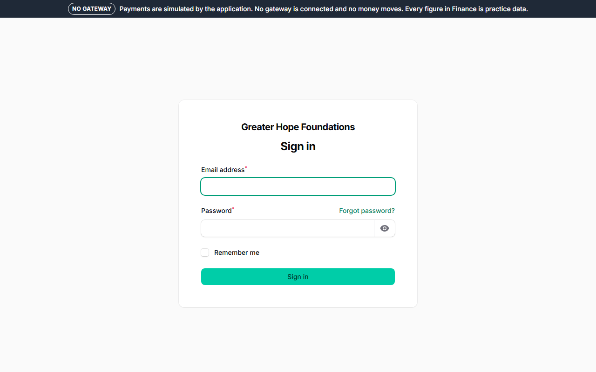
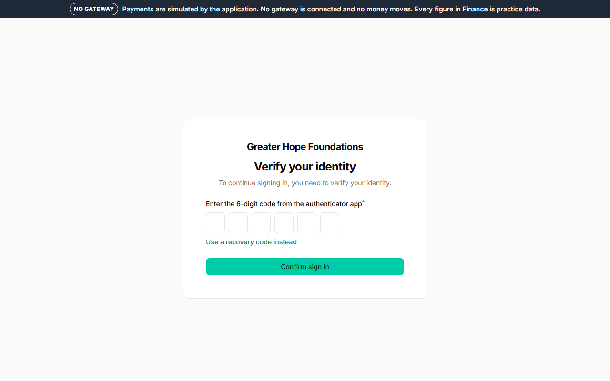
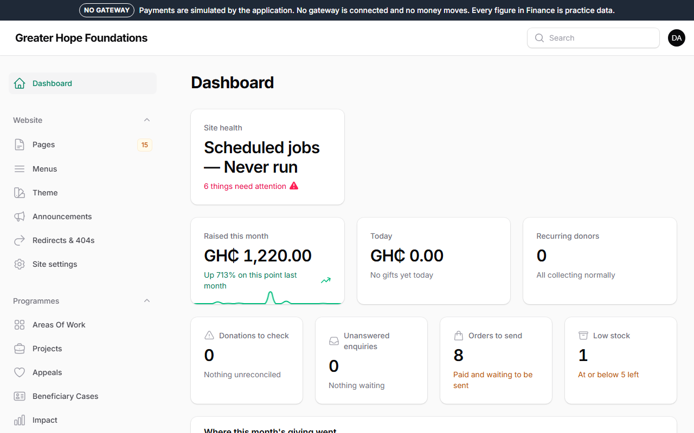
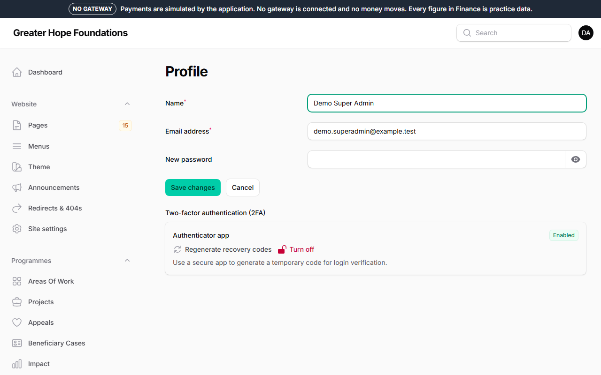

# 1. Signing in and setting up your authenticator

## Your account

Somebody with the *Super Admin* or *Admin* role creates your account
(*System → Staff accounts*) with your name, your work email address and a
role. You receive an email with a link to set your password. The link is
good for one hour; if it has expired, use **Forgot password?** on the
sign-in page.

## Signing in

Open the admin address and enter your email and password.

The first time, the panel will not let you in until you have set up an
**authenticator app**. This is not optional: it is what stops somebody
who has guessed or stolen your password from reaching the donors' details.

## Setting up the authenticator (once)

1. On your phone, install an authenticator app if you do not have one.
   **Google Authenticator**, **Microsoft Authenticator** or **Authy** are
   all fine and free.
2. After signing in for the first time you see a QR code. Open the app,
   choose *add* or *+*, and scan the code. The app now shows a six-digit
   number that changes every 30 seconds.
3. Type the current six digits into the panel to confirm.
4. **Write down the recovery codes** the panel shows you and keep them
   somewhere that is not your phone — a drawer at the office, a note in a
   safe. Each code works once, and they are the only way back in if your
   phone is lost.

Every sign-in from then on: password, then the six digits from the app.

## The dashboard

After signing in you land on the dashboard: this month's giving, what
needs attention today, and the site's health in one card.

## If you lose your phone

Use one of your recovery codes to sign in, then go to your profile (your
initials, top right → *Profile*) and set up the authenticator again on
the new phone.

No phone and no recovery codes: ask a Super Admin. They can reset your
authenticator from *Staff accounts* — they will ask you to prove who you
are, and the reset is recorded.

## Signing out, and sessions

**Sign out** is under your initials, top right. The panel signs you out
by itself after a period of no activity, and after a fixed number of
hours regardless. If you ever think somebody else has used your account,
change your password from your profile — that also signs out every other
device.

## What you can and cannot see

Your role decides which parts of the panel exist for you. A Content
Editor does not see Finance; a Finance Officer does not see the page
builder. If you need something you cannot see, ask; do not share a
sign-in.
