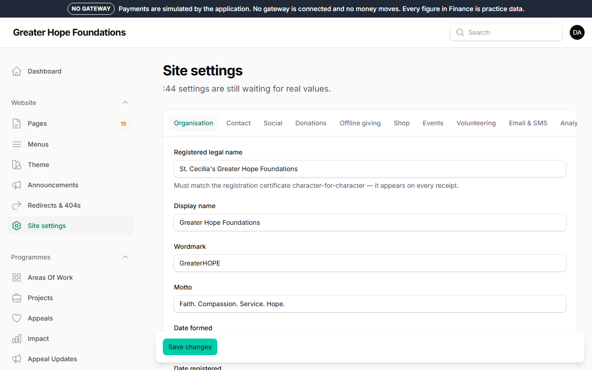
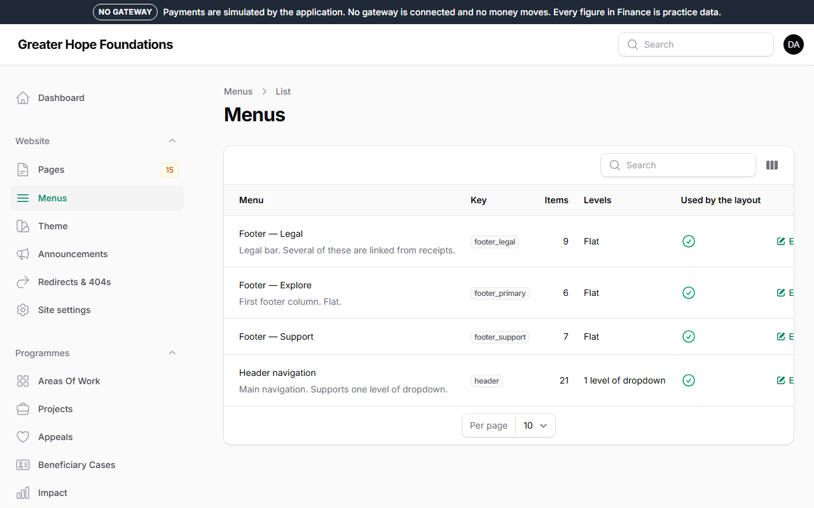
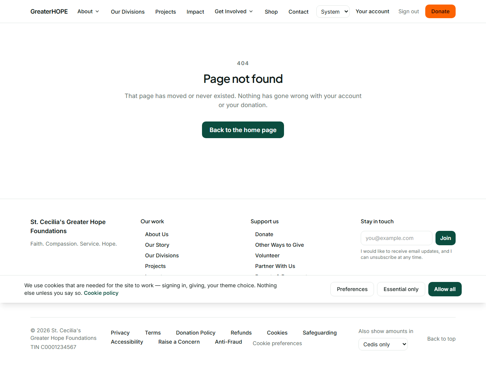

# 2. The header, footer, menus and homepage

Everything a visitor sees is something you can change. Nothing here needs
a developer.

## Where things live

| What you want to change | Where |
|---|---|
| The phone number, email, address, office hours, social links | *Website → Site settings* → the **Contact** and **Social** tabs |
| The foundation's name, the wordmark, the motto, the TIN | *Site settings* → **Organisation** |
| The logo (light and dark), whether the header sticks, the top bar | *Site settings* → **Header** |
| The footer headings, the newsletter box, the "back to top" link, the cookie notice text | *Site settings* → **Site & footer** |
| Which links appear in the header and in the three footer columns | *Website → Menus* |
| A message across the top of every page ("Office closed on Monday") | *Website → Announcements* |
| The homepage itself | *Website → Pages* → the page marked **Home** |
| The colours | *Website → Theme* (chapter 8) |

**Every change is live the moment you press Save.** There is no
"publish the site" step. (Behind the scenes the site keeps a copy of each
page for a few minutes to stay fast; your save clears those copies.)

## Site settings

Each tab is a group of settings with a label and a description under it.
A setting that still shows a placeholder like `{{PHONE_PRIMARY}}` has
never been filled in — the site shows nothing there until you do.
**Search engines → Allow indexing** is the one switch that lets Google
list the site; it is off on the practice site on purpose.

## Menus

There are four menus: **header**, and the footer's **primary**, **support**
and **legal** columns. Open one and you see its items in order. For each
item:

- **Label** — the words the visitor sees.
- **Link to** — a page on this site (pick it from the list; if the page
  is later unpublished, the link disappears by itself), a web address, or
  a heading with items under it.
- **Show to** — everyone, or only signed-in donors.
- **Visible** — untick to hide an item without deleting it.

Drag the handle on the left to reorder. An item under another item becomes
a drop-down in the header. Save, and the site reflects it.

A header drop-down opens on a click or a tap, and — with a mouse — when
the pointer rests on it. *Site settings → Site & footer → Open menus on
hover* turns the hover part off; touch and keyboard are unaffected.

The footer's **legal** menu is shown in groups (*Legal*, *Giving*,
*Conduct*) decided by the page each link points at. *Site settings →
Site & footer → Footer policy groups* is that list; a policy page not
named in it appears under *Policies*.

## Announcements

An announcement is a band across the top of every page (or the pages you
name), between a start and an end time, with an optional button. Visitors
can close it and it stays closed for them. Use it for closures, a
campaign, an emergency.

## The homepage, and any page

Pages are built from **sections**, stacked top to bottom. Open *Website →
Pages*, then the page marked Home.

Each section is one kind of block — a hero, a row of featured appeals,
a paragraph, an impact-numbers strip, a call-to-action band, a gallery,
the newsletter box, and so on. To change the homepage:

1. **Add a section**: the *Add section* button, choose the kind.
2. **Fill in its fields**: each kind asks only for what it needs.
3. **Presentation** (the small row under the fields): background,
   width, spacing — a closed list of choices, so every page stays on-brand.
4. **Reorder** by dragging; **hide** a section with its toggle rather than
   deleting it if you might want it back.
5. **Save**. Then look at the site.

Every save keeps a **revision**. *Revisions* (top right of the page
editor) shows each one with who and when; **Restore** puts it back.

A page can be a **Draft** (only staff see it, via *Preview*), **Published**,
or **Scheduled** for a date and time.
