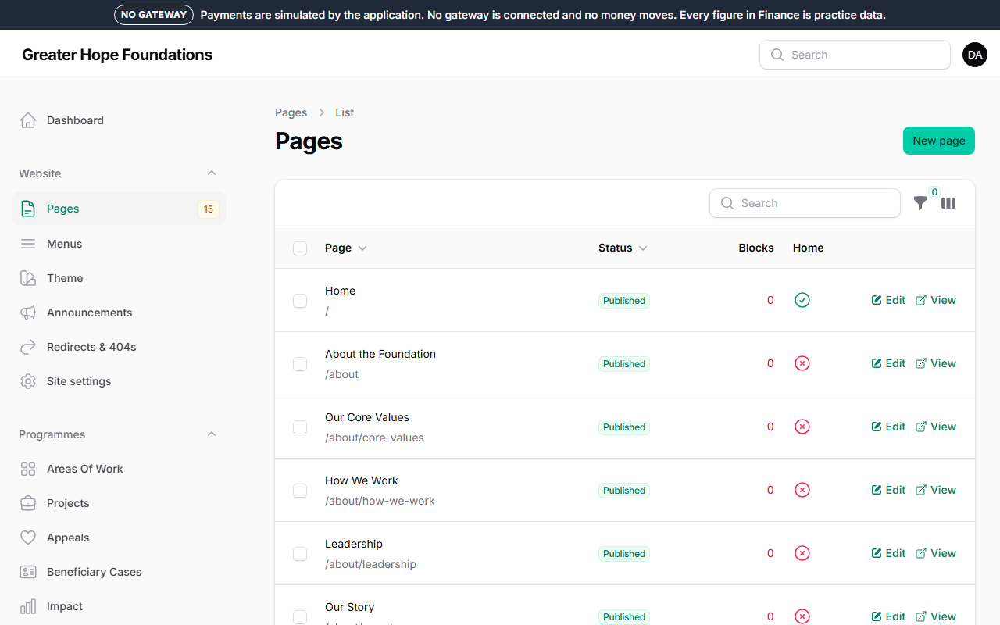
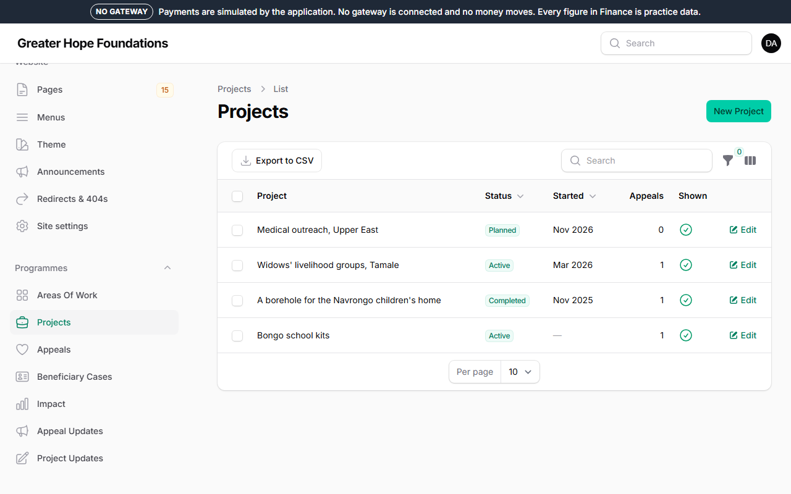
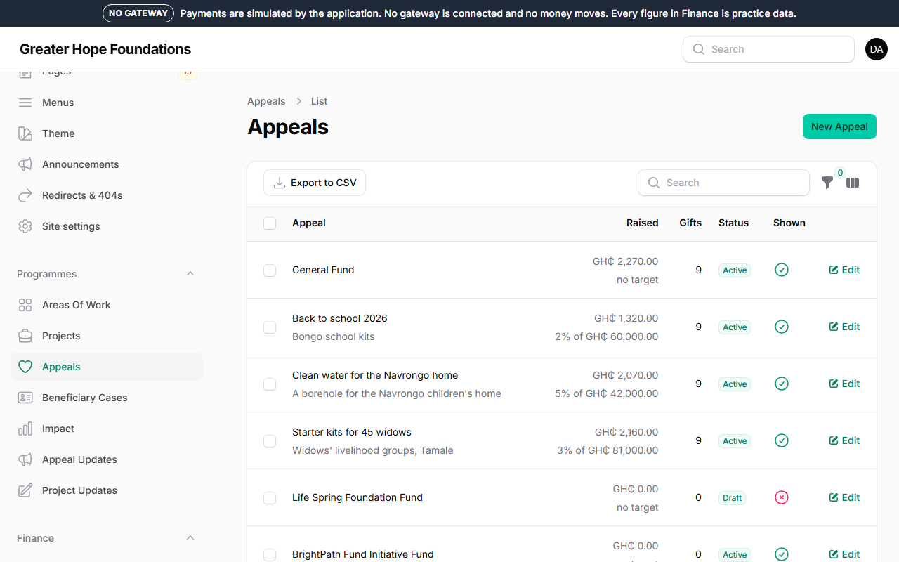
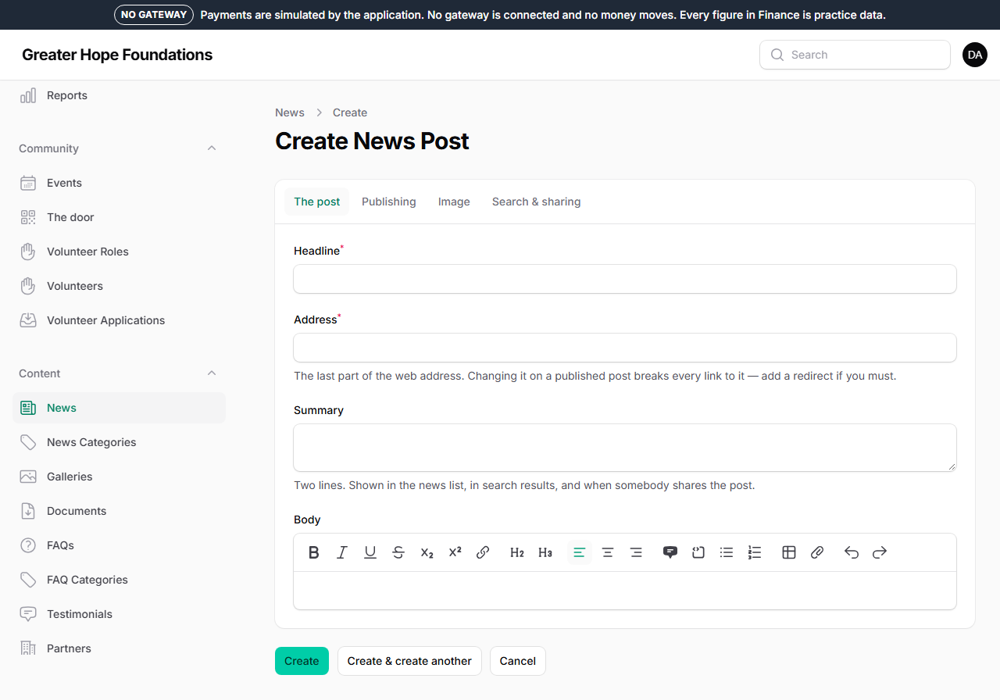
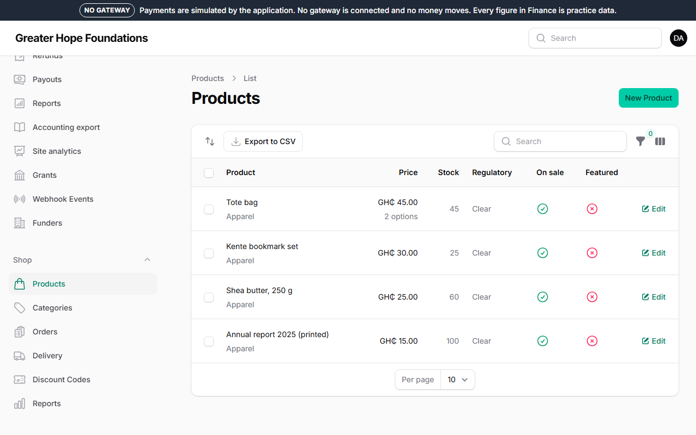
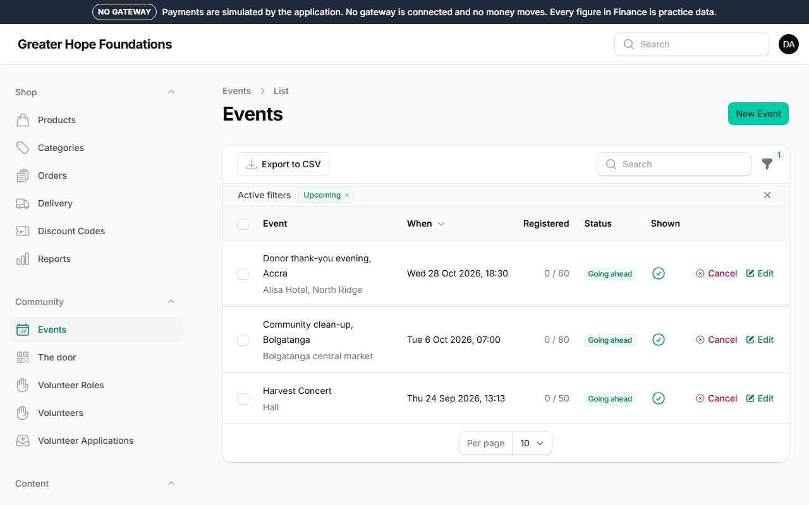

# 3. Creating content

Every kind of content works the same way: a list you can search and
filter, a **New** button top right, a form with the fields explained
under them, **Save**. Nothing goes on the site until it is published, and
you can always preview first.

## Things every form has

- **Title / Name** — the slug (the words in the web address) is made from
  it automatically. You can change the slug, but do not change it after
  something has been shared: the old links would break.
- **Status** — *Draft* (staff only), *Published*, or *Scheduled* with a
  date. Drafts have a **Preview** link that only works while signed in.
- **Search & sharing** (a tab or section at the end) — the title and text
  Google and WhatsApp show. Leave it empty and the site uses the title,
  summary and main image. Fill it in only for the ten pages that matter.
- **Main image** — picked from the media library (chapter 4).

## A page

*Website → Pages → New.* Pages are built from sections — chapter 2
explains the editor. A page can sit under another page (*Parent*), which
puts it in the address (`/about/team`) and in the breadcrumbs.

## A project

*Programmes → Projects → New.* A project is a piece of work with a place,
a budget, a status (*Planned, Active, Completed, Paused*) and dates. Give
it a one-line summary (shown on cards), a description, a main image, the
area of work it belongs to, and — once it is running — **Project updates**
(*Programmes → Project Updates*), which are the short field reports that
appear on the project's page.

## An appeal (a cause)

*Programmes → Appeals → New.* An appeal is what people give **to**. It has
a goal in cedis, a status, an optional link to the project it funds, and
optional **giving levels** ("GH₵ 50 provides a school kit"). The donate
page offers it once it is published; the appeal's page shows how much has
been raised and — if the setting is on — the donor wall.

The **General Fund** is the appeal that gifts go to when the donor did not
choose one. It always exists; do not unpublish it.

**Appeal updates** (*Programmes → Appeal Updates*) go on the appeal's page
**and are emailed to everybody who gave to it**. Write them when there is
something to show.

**The live screen.** Every published appeal has a page made for a
projector: open the appeal and press **Live screen** (top right). It shows
the total in very large type, the bar, the last five first names and a QR
code that opens the donate page for that appeal — put it on the screen at a
dinner and watch it climb as guests give by MoMo. It refreshes itself every
five seconds. It is dark; add `?theme=light` to the address for a bright
room. Anonymous gifts show as "Anonymous"; amounts are never shown beside
names.

## A news post

*Content → Posts → New.* A headline, an excerpt (the two lines under it),
the body, a category, a main image, tags. *Feature this post* puts it at
the top of the news page. Comments are moderated: they appear only after
somebody approves them in *Inbox → Comments*.

A post is the best thing you can send a donor to. One a month is enough.
Ideas that work: what GH₵ 50 actually paid for, a day at a project, where
the money went this quarter.

## A shop product

*Shop → Products → New.* A product has a name, a summary, a description, a
category, photographs, and one or more **variants** (sizes, colours) each
with its own price and stock. Prices are in cedis; the site shows
`GH₵ 45.00`.

- **Kind**: something posted, something downloaded (a PDF, with a link
  that expires), a gift that becomes a donation (a "sponsor a meal"
  product), or a ticket for an event.
- **In stock**: the count. *Sell when out of stock* lets people order on
  backorder. **Adjust stock** on the product records why the number
  changed.
- **Proceeds fund**: which appeal the profit is counted towards.
- **Regulatory screen**: some categories (anything medical, anything
  edible) need a second person to confirm the product may be sold. The
  form tells you.

## An event

*Community → Events → New.* Title, when it starts and ends, where (or
*Online* with a link), the region, a summary and description, a main
image. *People register to come* turns on registration with a number of
places; when they are full, later registrations go on a waiting list.
Registered people get a reminder the day before, automatically. After the
event, record **How many came** and attach a gallery — the archive page
uses both.

The **Door** page (*Community → Door*) is for the person at the entrance:
it works on a phone and scans the QR code on each ticket.

## Deleting things

Most content is not deleted but **unpublished**; it stays in the admin.
Where a delete button exists, the item goes to a bin you can restore from
(*Deleted* filter on the list). Donations, orders, receipts and the audit
trail cannot be deleted by anybody.
