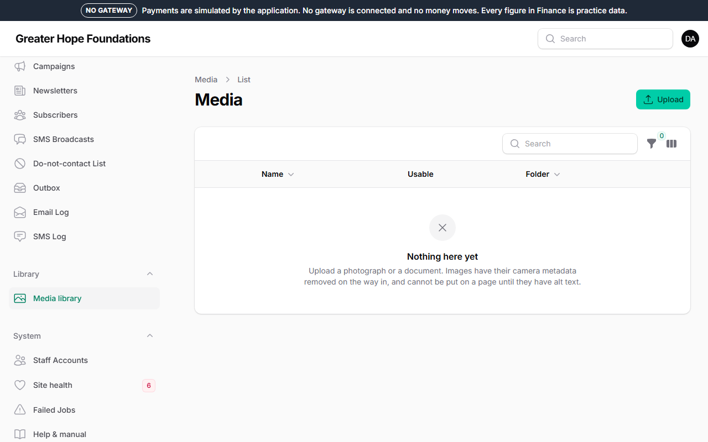

# 4. Images and alt text

## The media library

*Library → Media* is every image and document on the site, in folders.
Upload here, or from any *Main image* field (which opens the same
library). A photograph is resized into the sizes the site needs by
itself; you upload the original once.

What happens to a photograph the moment it is uploaded, without you doing
anything: the hidden camera data — including the **GPS location** phones
record in every photo — is stripped. The site will not keep a file that
still carries a location, because a picture of a child with the
coordinates of their home inside it is the one thing this foundation must
never publish.

## Alt text — required

Every image has an **Alt text** field, and an image without one **cannot
be put on a public page**. Alt text is the sentence a blind visitor's
screen reader speaks instead of the picture, and it is what Google reads
too.

Write what the picture shows, as you would describe it on the phone:

- ✔ "Two girls in green uniforms reading at a desk in a Bongo classroom"
- ✔ "The new borehole at the Navrongo children's home, with the storage tank behind"
- ✘ "image1.jpg", "photo", "children"

Do not start with "picture of". Keep it to a line. If the image is purely
decorative — a pattern, a background — tick **Purely decorative** and no
alt text is needed; screen readers then skip it.

## Photographs of people, and consent

When you upload a photograph, the library asks **Shows a person?** and
**Shows a child?** Answer honestly; it is not a formality.

An image that shows a person **cannot be published until a consent
record is attached to it**: who gave the consent, when, for what use, and
— for a child — the parent or guardian, with the signed form scanned and
attached if you have it. *Record consent* on the image's page.

A consent can be **withdrawn** at any time, from the same place, with a
reason ("the mother rang and asked" is enough). The image disappears from
every page it was on at once, and stays in the library marked withdrawn.

If you are not sure whether somebody agreed, the answer is no. Use a
different photograph.

## Licensed stock photographs

The site launched with licensed photographs — real pictures of Ghanaian
life from Unsplash — in a folder called **Launch photography**. Each one
is marked **Source: Licensed stock image** with a link to where it came
from and the photographer's name in the credit. The consent rule above does
not apply to them: the people in them were released to the photo
provider, and the licence is the permission.

They are placeholders. As the foundation's own photographs arrive,
**replace** each one from its page in the library (the *Replace* action):
the new picture takes the old one's place everywhere it was used, and the
consent rule applies to it as normal. Do not upload your own photograph as
"stock" to skip the consent — the launch checklist counts stock pictures
of people, and a photograph of a beneficiary recorded as stock is a
promise to that person broken twice.

## Documents

PDFs (the annual report, a policy) go in the library too and appear on
the *Reports* page through *Content → Documents*. Give a document a
title and a year; the file name is not shown.

## Sizes and speed

Most of the foundation's visitors are on a phone on mobile data. The
site does the resizing, but it cannot make a 20 MB photograph small
before it is uploaded. Photos straight from a phone are fine; exports
from a design program at print resolution are not — ask for a web-sized
version (about 2000 pixels on the long side).
