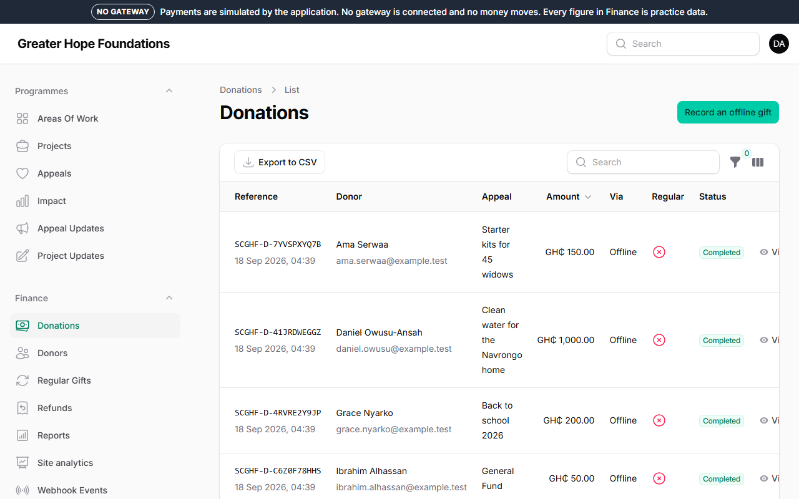
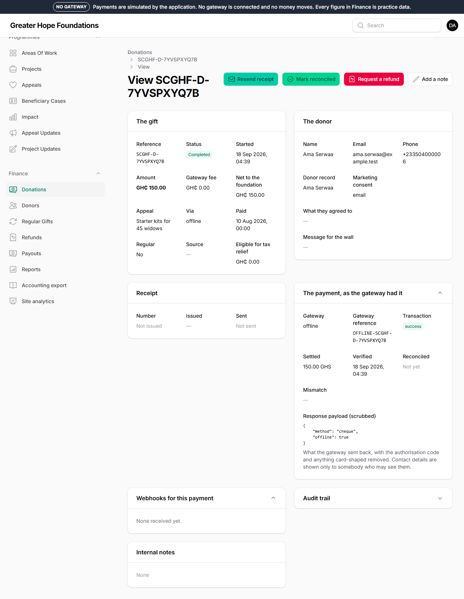
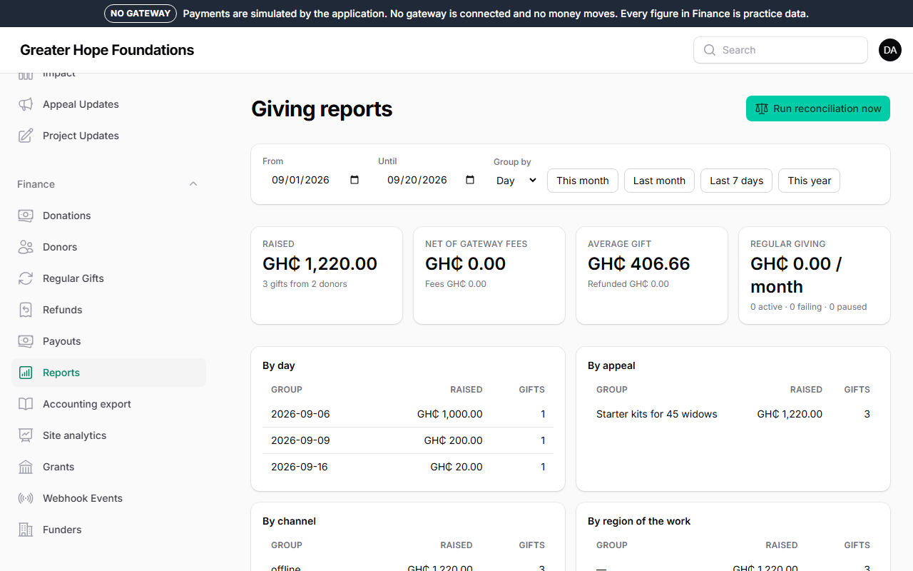
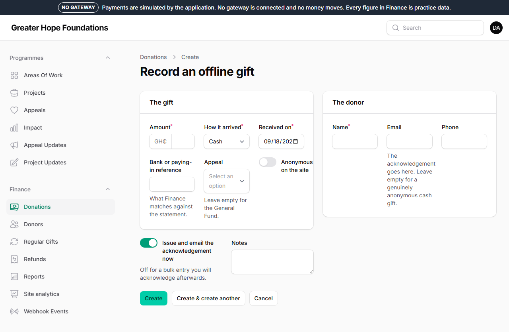

# 5. Donations

Everything about money is under **Finance**. Only staff with a finance
role see it.

## Seeing who gave

*Finance → Donations* lists every gift, newest first: the reference (the
donor quotes it if they write in), the donor, the appeal, the amount, how
it was paid, whether it is a regular gift, and the status.

**Statuses:**

| Status | Meaning |
|---|---|
| Completed | the money arrived and the receipt went out |
| Pending | the donor is still paying (a Mobile Money prompt takes a minute) |
| Failed / Abandoned | they tried and it did not go through; nothing was taken |
| Needs review | the payment company reported a different amount from the one we asked for. **The site will not count it until a person looks.** Open it, read the note, and ask the treasurer |
| Refunded | given back, through the two-person process below |

Open a gift to see everything about it: the donor, the receipt, the
payment as the gateway reported it, and the audit trail of who did what.

**A gift is never edited or deleted.** If something about it is wrong, it
is refunded and given again. You can add an internal **note**.

## Exporting for the accounts

**Export to CSV** on the donations list downloads what is on screen —
use the filters first (a date range, an appeal, completed only). The file
opens in Excel. Amounts are in cedis with two decimals.

*Finance → Reports* is the treasurer's page: totals by month and by
appeal, fees, net, regular giving, and **Run reconciliation now**, which
compares our records with the payment company's for the period and lists
anything that does not match.

## The accounts: the monthly journal

*Finance → Accounting export.* Instead of re-typing the month into the
accounts, download it as journal lines: every gift, order, fee, refund and
payout as a balanced debit and credit, ready to import. Pick the month,
check the page says **Balanced.**, press **Download CSV**. The file is
shaped for the package chosen under *Site settings → Accounting*
(QuickBooks, Xero, Zoho Books, or a plain spreadsheet), and the account
codes and names there are what the file carries — change them once to
match the accountant's chart and every month after matches.

Import each month once. The download is recorded with your name and the
month.

## Recording a cash, cheque or bank-transfer gift

Somebody hands you an envelope, or the bank statement shows a transfer.
*Finance → Donations → Record an offline gift*:

1. The **amount** in cedis, the **appeal** (General Fund if they did not say).
2. **How it arrived**: cash, cheque (the cheque number is required — it is
   what the bank statement is matched against), bank transfer, in kind.
3. The donor's **name**, and their **email** if you have it — that is
   where the receipt goes. Tick *Anonymous on the site* if they asked.
4. **Received on** — the real date, not today, if it was earlier.
5. **Issue and email the acknowledgement now** — leave it ticked unless
   you are entering a batch and want to send receipts afterwards.

The gift then appears with the others, counts towards the appeal, and is
in the reports. It is marked *Offline* and shows who recorded it.

## Resending a receipt

On the gift's page, **Resend receipt**. It goes to the email on the gift;
change the email first if it was mistyped (the *donor record*, not the
gift — the gift keeps what was entered). Every receipt has a number in
sequence; resending does not issue a new number.

## What a donor sees when they sign in

A donor with an account sees, under *Your account*: **Overview** (totals and
recent gifts), **Your impact** (every gift, followed by the appeal updates
you published after it and the public impact figures since their first
gift — so *Appeal Updates are what fill this page*), **Receipts** (every
receipt filed by year, with the year's total and the deductible total, each
as the PDF), **Regular giving** (pause, resume, change the amount or stop a
standing gift), their details, security and data. Nothing on these pages
needs staff: a donor who asks "can I have my receipts for last year" can be
told where to look.

## Regular gifts

*Finance → Regular gifts* is every monthly or weekly gift: when it next
charges, how many times it has failed. A donor manages their own from the
link in their emails; you can **pause** or **cancel** one on request, with
a note saying who asked.

## Refunds — two people, always

A refund is requested by one person and approved by another. Nobody can
do both.

1. On the gift: **Request a refund**, the amount (up to the gift), the
   reason. This creates a request under *Finance → Refunds*.
2. A **different** finance user opens *Refunds* and presses **Approve
   and send**. The money goes back through the payment company; when
   they confirm, the gift shows *Refunded* and the appeal's total drops.
3. Cash gifts are refunded by hand; record it on the request's note.

If more than three refunds are approved in a day the site emails the
alerts address — that is deliberate.

## Donors

*Finance → Donors* is one record per person, with all their gifts. Two
records for the same person (a typo in the email) can be **merged**; the
gifts move to the surviving record and nothing is lost.

## Test mode

A band across the top of every admin page that says **TEST MODE** or **NO
GATEWAY** means the payment company is not connected for real. Every
figure under Finance is practice data while that band is there. Do not
report it as income.
