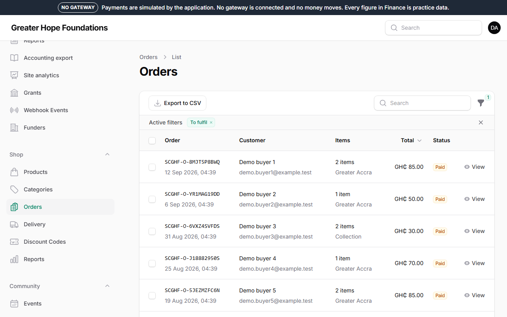
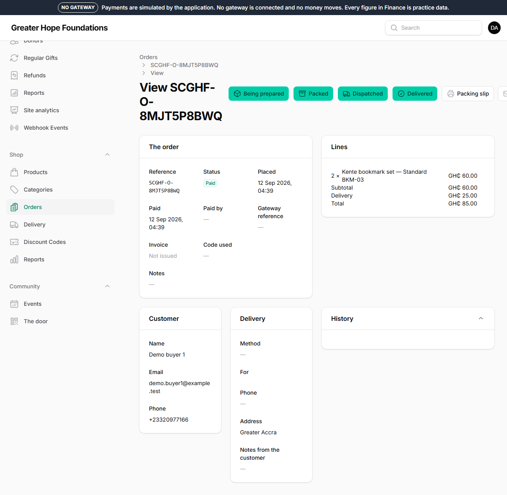

# 6. Shop orders

*Shop → Orders.* An order appears here the moment somebody pays. The list
shows the reference, the customer, the items, the total and the status;
the **To fulfil** filter shows only what is paid and waiting.

## An order's page

Everything about it: the items and prices, the customer's details, the
delivery address as they typed it (with the GhanaPost GPS code if they
gave one) or the collection point, the payment as the gateway reported
it, every email the customer has been sent, and the audit trail.

## Moving it along

The buttons at the top move the order one step at a time. **Each step
emails the customer**, so press a button when it is true, not before.

| Press | When | The customer is told |
|---|---|---|
| **Being prepared** | you have started on it | that it is being prepared |
| **Packed** | it is boxed and labelled | — |
| **Mark as dispatched and tell the customer** | it has left — the form asks for the courier and the tracking reference | how it is coming, with the reference |
| **Out for delivery** | the courier says so | that it arrives today |
| **Delivered** / **Collected** | it arrived, or they picked it up | that it is done, and asks them to tell you if anything is wrong |
| **Completed** | nothing more to do | — |

**Packing slip** prints one; **Print packing slips** on the list prints
a batch for the day. **Invoice PDF** is what the customer already
received by email.

## Collection orders

If the customer chose to collect, the order says where and during which
hours (from *Shop → Delivery zones*, the *Collection* zone). Press
**Collected** when they have.

## Problems

- **Wrong address**: correct it on the order before dispatch (*Edit*),
  and add a note saying the customer asked.
- **Out of stock after payment**: the item's stock is held at checkout,
  so this should not happen; if it does, contact the customer and refund
  the line.
- **Cancelling**: an **unpaid** order can be cancelled (the stock goes
  back on the shelf). A **paid** order cannot be cancelled here — the
  money has to go back first: **Request a refund**, then a second person
  approves (chapter 5). Stock returns when the refund is confirmed.
- **Needs review**: the payment company reported a different amount from
  the order total. As with donations, a person decides.

## Stock

*Shop → Products → the product → Adjust stock* records a delivery, a
count correction or breakage, with the reason. **Low stock** on the
dashboard lists products at or under five. Orders on backorder (if the
product allows it) are fulfilled when stock arrives.

## Reports

*Shop → Reports*: sales by product and by month, net proceeds after
costs, what each product has raised for its appeal.

## A rider of our own

When the foundation's own rider or agent takes the parcel, use **Assign a courier** on the order instead of *Dispatched*: they confirm pick-up, out-for-delivery and the delivery itself from their phone, with proof, and the customer is told at each step. Chapter 13 has the whole of it.
