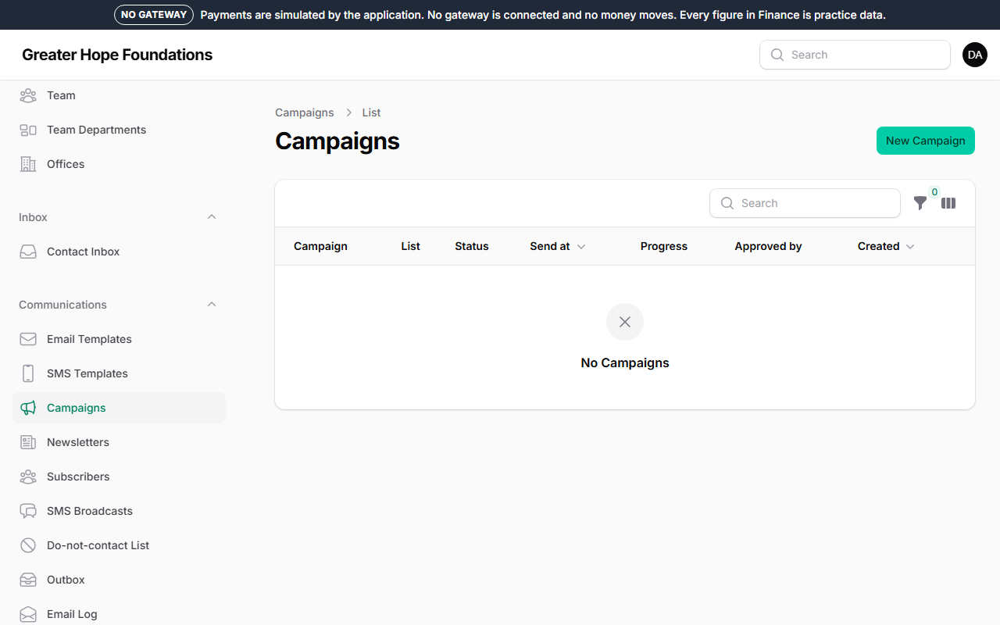
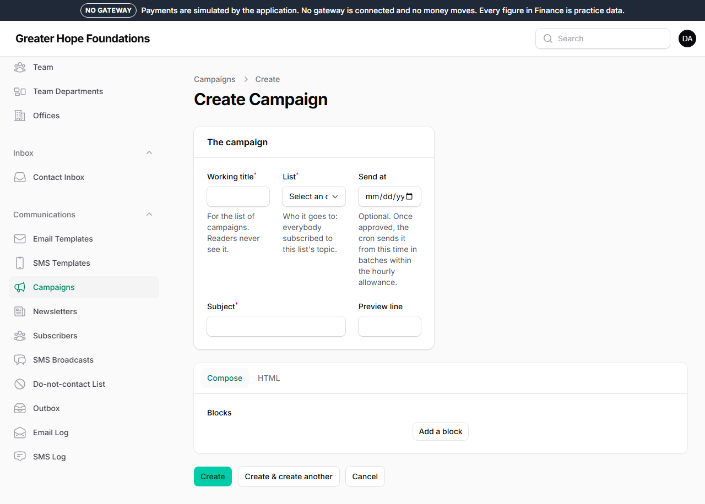
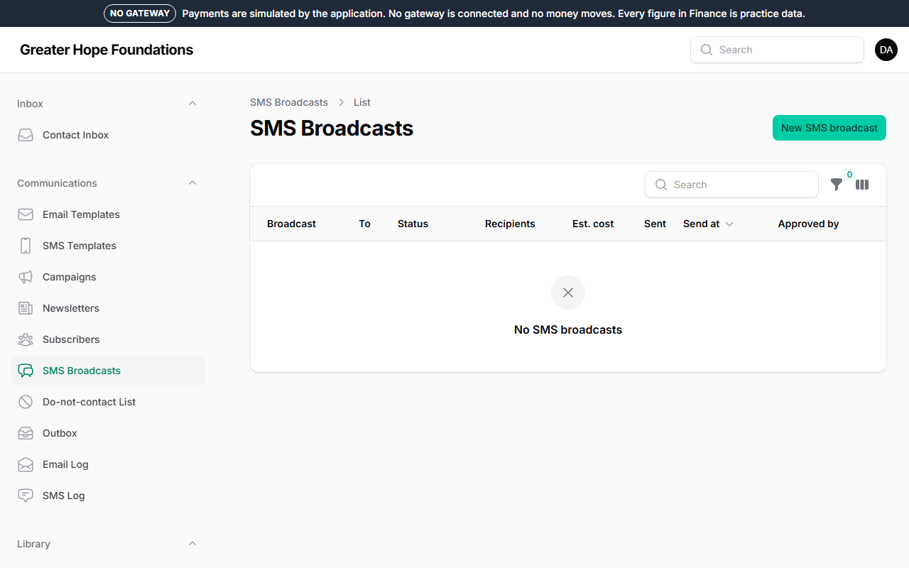
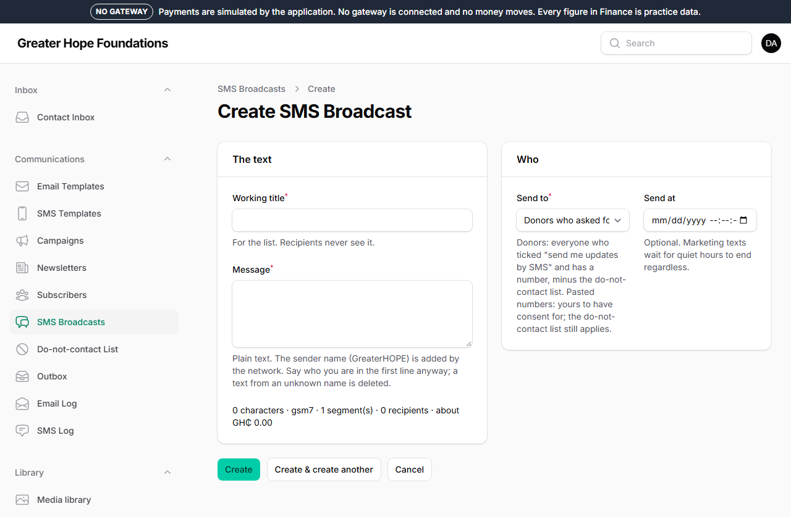

# 7. Newsletters and SMS

Both send to many people at once, both need a second person to approve,
and both cost the foundation something — money for SMS, reputation for
email (a newsletter people did not ask for gets the foundation's emails
marked as spam, and then receipts stop arriving too).

## Who receives what

- **Newsletters** go to the *subscribers* list: people who signed up on
  the site and **confirmed by clicking the link** in the email they were
  sent. Nobody is added by hand. *Communications → Subscribers* shows
  them and their topics; anyone can unsubscribe from a link in every
  message, and that is honoured instantly.
- **SMS broadcasts** go to donors who ticked *send me updates by SMS*
  and gave a number — minus the **do-not-contact list**
  (*Communications → Suppressions*), which is never overridden. You can
  also paste numbers, but then the consent is yours to have.

## Sending a newsletter

*Communications → Newsletter campaigns → New.*

1. **Working title** (for your list; readers never see it), the **list**,
   the **subject** and the **preview line** (the grey text under the
   subject in an inbox — write it as a reason to open).
2. **Build** the message from blocks: a heading, a paragraph, a picture
   with a caption, an appeal card (drawn with its title and how far it has
   got, as it stands when the campaign is sent), a button, a rule. It is
   turned into an email that works in every email program, with a plain
   text version underneath.
3. **Send me a test**: it arrives in your inbox in a minute. Read it on
   your phone.
4. **Send at** — optional; otherwise as soon as it is approved.
5. Save. The campaign is now *Awaiting approval*.
6. A **different** person with the approval permission opens it, reads it
   (the *Preview*), and presses **Approve**.

Once approved it goes out in batches over the following hour or two — the
site sends a few hundred an hour on purpose, because bursts get flagged as
spam. **Pause** stops it between batches; **Resume** carries on. The
campaign's page shows sent, delivered, opened and clicked (opens and
clicks only if tracking is switched on in *Site settings → Email & SMS*;
receipts are never tracked).

## Sending an SMS broadcast — and what it costs

*Communications → SMS broadcasts → New.*

The **message**: 160 characters is one text. Longer messages are sent as
two or more *segments* and **each segment costs the same again**. The
form counts as you type and shows the segments; a message over the
maximum (two segments) is refused. Emoji and some symbols make the
message count double — avoid them.

Before you can save, the form shows **what this broadcast will cost**:
recipients × segments × the price per segment. The foundation has a
**monthly SMS budget** (*Site settings → Email & SMS*) and a broadcast
that would take the month over it is refused with the figure.

Then, as with newsletters: save, a **different** person approves, and it
is sent in batches within the hourly allowance. Marketing texts are never
sent at night; the site holds them until morning.

**Site Health → SMS credits** shows the balance with the provider. When
it is low the site emails the alerts address once a day. Top up with the
provider before it runs out — a receipt SMS that cannot be sent is a
donor who wonders whether their gift arrived.

## What is sent without you

Receipts, order confirmations, event reminders, volunteer messages,
password resets: all automatic, from the templates in *Communications →
Email templates* and *SMS templates*. You can change the wording of any
template; the placeholders in curly brackets (`{{ amount }}`) are filled
in per message. **Send me a test** on a template shows it filled with
sample values. Do not remove a placeholder from a receipt.

*Communications → Email log* and *SMS log* show every message the site
has sent, with whether it was delivered — the first place to look when
somebody says "I never got it".
