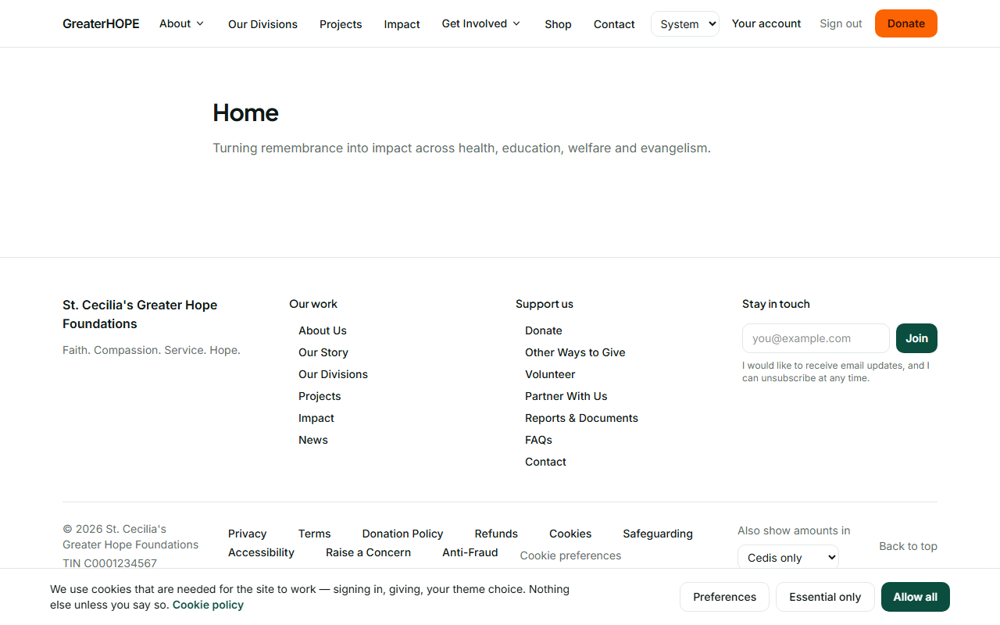
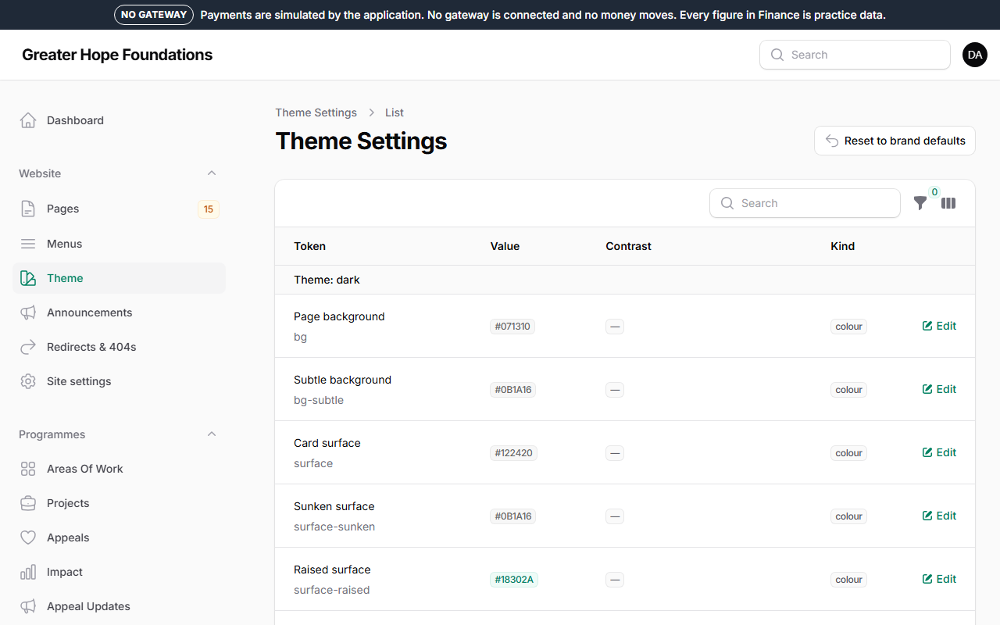

# 8. Colours, the theme and dark mode

## Light, dark and Vibrant

The site has three looks: light, dark, and a third, warmer palette
called **Vibrant** — cream ground, the teal and the coral at full
strength. **Visitors choose** with the small control in the header;
*System* is not a fourth look but a rule: follow whatever their phone
or laptop is set to, which is why it looks identical to Dark on a dark
device. Their choice is remembered on their device.

*Site settings → Site & footer → Default theme* is what a **first-time**
visitor sees before choosing — pick *Vibrant* there to make it the
site's default. *Name of the third theme* in the same place is what the
control calls it.

You do not need to switch anything to check the dark look: choose *Dark*
in the header on your own browser, look at the pages you changed, and
switch back. Every part of the site was drawn for all three; if something you
added looks wrong in one of them, it is almost always an image with a
white background — use one with a transparent or dark-friendly background.

## The brand colours

*Website → Theme* lists every colour the site uses, for the light theme
and the dark theme: page background, card surface, text, the brand
primary (buttons), the brand secondary (the donate button and warnings),
links, borders, the focus ring.

**Edit** a colour and pick or type a new one. The **Contrast** column is
the check that matters: text on a background must reach the accessibility
standard (a ratio of at least 4.5:1). The editor refuses a value that
fails it, and tells you what would pass — that is not fussiness; a
grey-on-grey donate button is money the foundation does not receive from
the people who could not read it.

**Reset to brand defaults** puts every colour back to the palette from
the foundation's brand pack. Use it if a change went wrong.

Changes are live at once. Look at a page in both themes after you
change anything.

## Logos and fonts

The logos are in *Site settings → Header*: a **light-background** version
(the full name beside the mark), a **dark-background** version (the same,
with the green words in white) and a **square icon** (the mark alone, for
the phone icon). The site arrived with the foundation's own logo pack in
all three, in the *Brand* folder of the media library. To change a logo,
open that file in *Media* and use **Replace file** — every place that
shows it (header, receipts, emails, the phone icon) updates at once. The
picture shown when a link to the site is shared on WhatsApp or Facebook
is *Site settings → Search engines → Social image*; it, too, arrived
filled in.

Titles are set in a serif typeface and everything else in a sans, as in
the design the foundation chose. The typefaces are part of the design and
are not changed from the admin.

## The phone icon and the offline page

Visitors on Android can add the site to their home screen ("Add to your
phone" appears in the footer when their browser offers it). The icon is made
from the **square icon** logo (or the light-background one if there is no
square icon) on a square of the primary brand colour, so replacing a logo or
changing the colour changes the icon; nothing to do. When a visitor loses their connection, they see the foundation's own
"You are offline" page with the Mobile Money and bank details from *Site
settings → Offline giving* instead of the browser's error — so keep those
filled in. If the feature must be switched off, `FEATURE_PWA_OFFLINE=false` in the
server's `.env` (ask the developer); a phone that installed the site will
quietly forget it on its next visit.

## What you cannot change here

The layout of the pages, the spacing, the shapes of buttons. Those are
design decisions made once with the brand pack so that every page a staff
member builds looks like the same site. If the foundation rebrands, that
is a job for the developer, and it is a small one.
